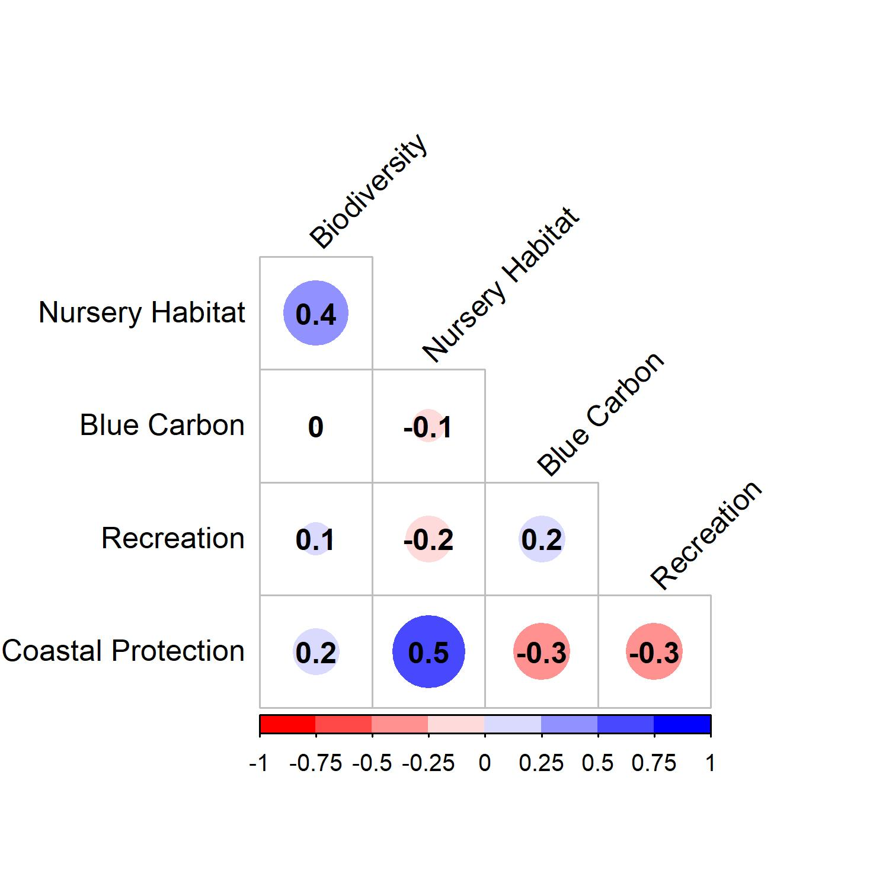
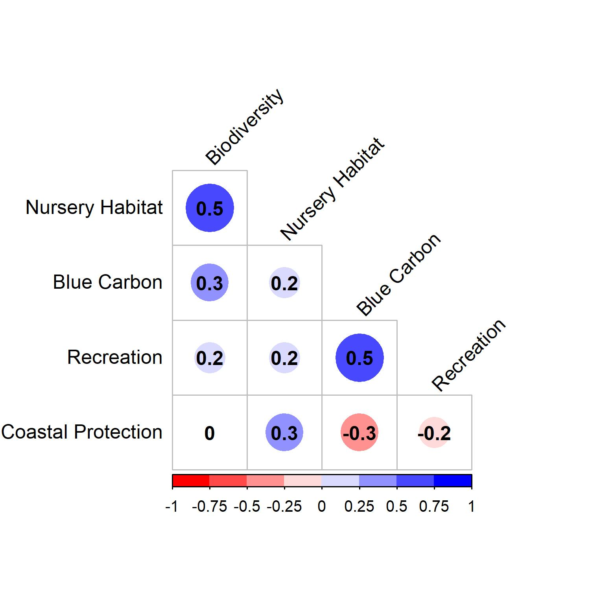
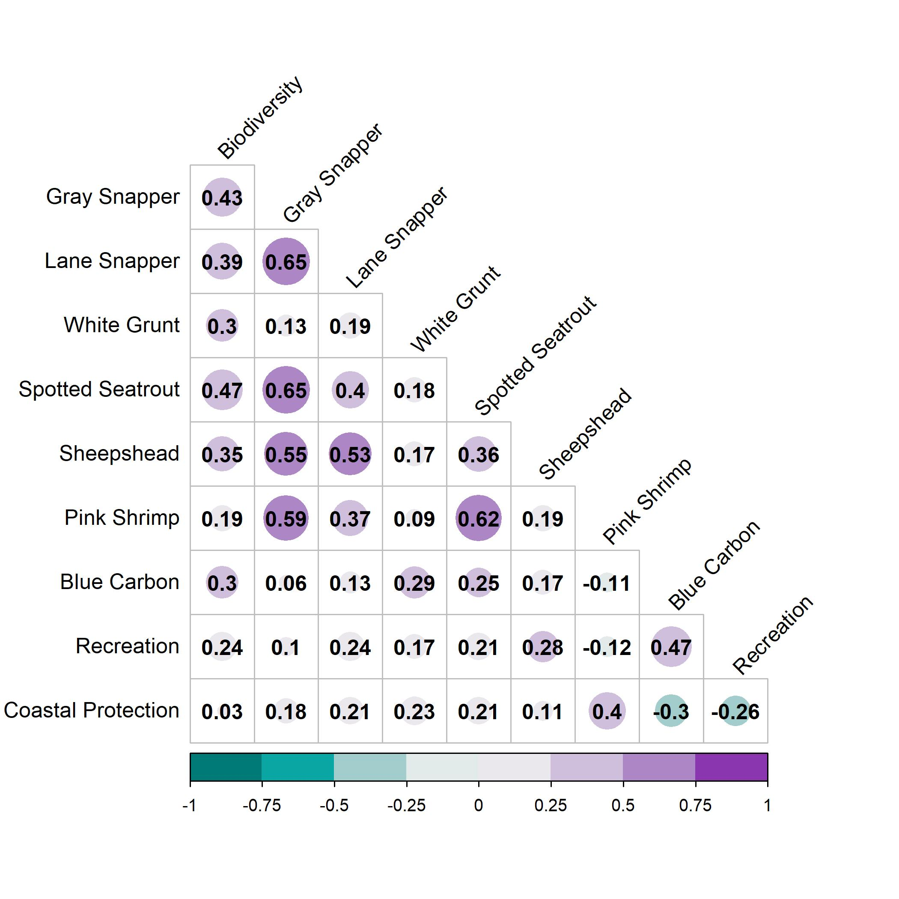

```{r setup, include=FALSE,fig.height=6}
knitr::opts_chunk$set(echo = FALSE, message = FALSE, warning = FALSE, fig.pos = "H", out.extra = "")

#Load Libraries
library(tidyverse)
library(raster)
library(RColorBrewer)
library(viridis)
library(ggpubr)
library(corrplot)
library(corrplot)
# remotes::install_version("Rttf2pt1", version = "1.3.8")
# library(extrafont)
library(colorspace)
library(paletteer); library(colorBlindness)
library("ggsci")
library("ggplot2")
library("gridExtra")
# library(rgeos)
library(veccompare)


#Setting Directory Paths
wd=getwd()

username=as.vector(strsplit(wd,"/"));names(username)<-c("username")

Saved_RData_Dir=paste("C:/Users/",username$username[3],"/Dropbox/GITHUB/Disseratation/",sep="")
```

# Paper Resources

Click [**here**](https://docs.google.com/document/d/1a-w1l9gmgQC8Fafp4zqLbFPMXytu6nq-nX5ImwAyuts/edit) to see the latest meeting notes in the Google Doc. 


To Do List:

* Make a matrix like the correlation plots but where it shows severity of trade-off instead 

  + In this case we want to use the proportion of pixels in the upper quartile of both services.

* Make pairwise plots for all service combinations, for both conservation areas and for restoration areas   

* Make pairwise plots at two different scales (from practical standpoint, scale should match conservation/restoration scale)


\newpage

# Visualizing Tradeoffs  plots of services 
```{r}

#Loading Data
# 1-Hectare Scale
ES_Zscores_PRAs_1HA_df <- read_csv("processed_datasets/ES_ZScores_PRAs_1HA.csv")

ES_Zscores_PRAs_1HA_df$Area<-c("Unconfirmed")
ES_Zscores_PRAs_1HA_df$Scale<-c("1-Hectare")

ES_Zscores_Confirmed_1HA_df <- read_csv("processed_datasets/ES_ZScores_Confirmed_1HA.csv")

ES_Zscores_Confirmed_1HA_df$Area<-c("Confirmed")
ES_Zscores_Confirmed_1HA_df$Scale<-c("1-Hectare")


names(ES_Zscores_PRAs_1HA_df)<-names(ES_Zscores_Confirmed_1HA_df)

ES_Zscores_1HA_df<-rbind(ES_Zscores_PRAs_1HA_df,ES_Zscores_Confirmed_1HA_df)


# 1-Kilometer Scale
ES_Zscores_PRAs_1KM_df <- read_csv("processed_datasets/ES_ZScores_PRAs_1KM.csv")

ES_Zscores_PRAs_1KM_df$Area<-c("Unconfirmed")
ES_Zscores_PRAs_1KM_df$Scale<-c("1-SQKM")

ES_Zscores_Confirmed_1KM_df <- read_csv("processed_datasets/ES_ZScores_Confirmed_1KM.csv")

ES_Zscores_Confirmed_1KM_df$Area<-c("Confirmed")
ES_Zscores_Confirmed_1KM_df$Scale<-c("1-SQKM")

names(ES_Zscores_PRAs_1KM_df)<-names(ES_Zscores_Confirmed_1KM_df)

ES_Zscores_1KM_df<-rbind(ES_Zscores_PRAs_1KM_df,ES_Zscores_Confirmed_1KM_df)

# 5-Kilometer Scale
ES_Zscores_PRAs_5KM_df <- read_csv("processed_datasets/ES_ZScores_PRAs_5KM.csv")

ES_Zscores_PRAs_5KM_df$Area<-c("Unconfirmed")
ES_Zscores_PRAs_5KM_df$Scale<-c("5-SQKM")

ES_Zscores_Confirmed_5KM_df <- read_csv("processed_datasets/ES_ZScores_Confirmed_5KM.csv")

ES_Zscores_Confirmed_5KM_df$Area<-c("Confirmed")
ES_Zscores_Confirmed_5KM_df$Scale<-c("5-SQKM")

names(ES_Zscores_PRAs_5KM_df)<-names(ES_Zscores_Confirmed_5KM_df)

ES_Zscores_5KM_df<-rbind(ES_Zscores_PRAs_5KM_df,ES_Zscores_Confirmed_5KM_df)

# 10 - Kilometer Scale
ES_Zscores_PRAs_10KM_df <- read_csv("processed_datasets/ES_ZScores_PRAs_10KM.csv")

ES_Zscores_PRAs_10KM_df$Area<-c("Unconfirmed")
ES_Zscores_PRAs_10KM_df$Scale<-c("10-SQKM")

ES_Zscores_Confirmed_10KM_df <- read_csv("processed_datasets/ES_ZScores_Confirmed_10KM.csv")

ES_Zscores_Confirmed_10KM_df$Area<-c("Confirmed")
ES_Zscores_Confirmed_10KM_df$Scale<-c("10-SQKM")

names(ES_Zscores_PRAs_10KM_df)<-names(ES_Zscores_Confirmed_10KM_df)

ES_Zscores_10KM_df<-rbind(ES_Zscores_PRAs_10KM_df,ES_Zscores_Confirmed_10KM_df)


```

## Simple corrplot for ES outcomes 
```{r,include=FALSE}
##Pearson Correlations 
ES_cors_Confirmed_1HA<-ES_Zscores_Confirmed_1HA_df

names(ES_cors_Confirmed_1HA)<-c("ID","Longitude","Latitude","Biodiversity","Nursery Habitat","Blue Carbon","Recreation","Coastal Protection","Seagrass-Area","Scale")

#main ecosystem services
ES_cors_Confirmed_1HA<-cor(ES_cors_Confirmed_1HA[c(4:8)])
write.csv(ES_cors_Confirmed_1HA,file="analytical_output/Cor_Coef_ConfirmedBeds_1HA.csv")
ES_cors_Confirmed_1HA<-round(ES_cors_Confirmed_1HA,1)


#saving the output
jpeg("plots/Figure_1_Confirmed_1HA.jpg", units="in", width=5, height=5, res=300)

corrplot(ES_cors_Confirmed_1HA, type = 'lower', order = 'original', tl.col = 'black',
         cl.ratio = 0.2, tl.srt = 45, col= colorRampPalette(c("red","white","blue"))(8),addCoef.col = 'black',diag=FALSE)
dev.off()

```


### Confirmed Seagrass Beds (1-Hectare Res.)

```{r fig.cap= "Pearsons correaltion between ecosystem service outcomes assocaited with confirmed seagrass beds in the Florida Gulf Coast (1-Hectare Res)"}

```


```{r,include=FALSE}
##Pearson Correlations 
ES_cors_PRAs_1HA<-ES_Zscores_PRAs_1HA_df

names(ES_cors_PRAs_1HA)<-c("ID","Longitude","Latitude","Biodiversity","Nursery Habitat","Blue Carbon","Recreation","Coastal Protection","Seagrass-Area","Scale")


#main ecosystem services
ES_cors_PRAs_1HA<-cor(ES_cors_PRAs_1HA[c(4:8)])
ES_cors_PRAs_1HA<-round(ES_cors_PRAs_1HA,1)


#saving the output
jpeg("plots/Figure_1_PRAs_1HA.jpg", units="in", width=5, height=5, res=300)

corrplot(ES_cors_PRAs_1HA, type = 'lower', order = 'original', tl.col = 'black',
         cl.ratio = 0.2, tl.srt = 45, col= colorRampPalette(c("red","white","blue"))(8),addCoef.col = 'black',diag=FALSE)
dev.off()


##Pearson Correlations 
ES_cors_PRAs_1KM<-ES_Zscores_PRAs_1KM_df

names(ES_cors_PRAs_1KM)<-c("ID","Longitude","Latitude","Biodiversity","Nursery Habitat","Blue Carbon","Recreation","Coastal Protection","Seagrass-Area","Scale")

#main ecosystem services
ES_cors_PRAs_1KM<-round(cor(ES_cors_PRAs_1KM[c(4:8)]),1)

#saving the output
jpeg("plots/Figure_1_PRAS_1KM.jpg", units="in", width=5, height=5, res=300)

corrplot(ES_cors_PRAs_1KM, type = 'lower', order = 'original', tl.col = 'black',
         cl.ratio = 0.2, tl.srt = 45, col= colorRampPalette(c("red","white","blue"))(8),addCoef.col = 'black',diag=FALSE)
dev.off()
```

\newpage

### Potential Restoration Areas (1-Hectare Res.)
The main difference between between PRAs and confirmed beds at this scale is that:

* Blue carbon is now positively correlated with biodiversity and recreation. 

* The negative correlation between recreation and coastal protection is also weaker.

```{r fig.cap= "Pearsons correlation between ecosystem service outcomes assocaited with potential restoration areas for seagrasses in the Florida Gulf Coast (1-Hectare Res)"}

```

\newpage

## Simple trade-off severity metric (i.e., fraction of points in the "win-win" quadrant for 2 services) 

```{r,include=FALSE}
names(ES_Zscores_1HA_df)

BioDiv_QT=quantile(ES_Zscores_1HA_df$BioDiv, probs = c(.75,.90))
NurHab_QT=quantile(ES_Zscores_1HA_df$NurHab, probs = c(.75,.90))
BlueCar_QT=quantile(ES_Zscores_1HA_df$BlueCar, probs = c(.75,.90))
RecTour_QT=quantile(ES_Zscores_1HA_df$RecTour, probs = c(.75,.90))
Expos_QT=quantile(ES_Zscores_1HA_df$Expos, probs = c(.75,.90))

QT=1
ES_Zscores_1HA_75th_df<-ES_Zscores_1HA_df%>%
  filter(Area=="Confirmed")%>%
  mutate(BioDiv_QT=ifelse(BioDiv>=BioDiv_QT[[QT]],1,0))%>%
  mutate(NurHab_QT=ifelse(NurHab>=NurHab_QT[[QT]],1,0))%>%
  mutate(BlueCar_QT=ifelse(BlueCar>=BlueCar_QT[[QT]],1,0))%>%
  mutate(RecTour_QT=ifelse(RecTour>=RecTour_QT[[QT]],1,0))%>%
  mutate(CoastProt_QT=ifelse(Expos>=Expos_QT[[QT]],1,0))%>%
  dplyr::select(BioDiv_QT:CoastProt_QT)%>%
  mutate(Bio_Nurs_WW=ifelse(BioDiv_QT==1 & NurHab_QT==1,1,0))%>%
  mutate(Bio_Blu_WW=ifelse(BioDiv_QT==1 & BlueCar_QT==1,1,0))%>%
  mutate(Bio_Rec_WW=ifelse(BioDiv_QT==1 & RecTour_QT==1,1,0))%>%
  mutate(Bio_Coast_WW=ifelse(BioDiv_QT==1 & CoastProt_QT==1,1,0))%>%
  mutate(Nurs_Blu_WW=ifelse(NurHab_QT==1 & BlueCar_QT==1,1,0))%>%
  mutate(Nurs_Rec_WW=ifelse(NurHab_QT==1 & RecTour_QT==1,1,0))%>%
  mutate(Nurs_Coast_WW=ifelse(NurHab_QT==1 & CoastProt_QT==1,1,0))%>%
  mutate(Blue_Rec_WW=ifelse(BlueCar_QT==1 & RecTour_QT==1,1,0))%>%
  mutate(Blue_Coast_WW=ifelse(BlueCar_QT==1 & CoastProt_QT==1,1,0))%>%
  mutate(Rec_Coast_WW=ifelse(RecTour_QT==1 & CoastProt_QT==1,1,0))

QT=2
ES_Zscores_1HA_90th_df<-ES_Zscores_1HA_df%>%
  filter(Area=="Confirmed")%>%
  mutate(BioDiv_QT=ifelse(BioDiv>=BioDiv_QT[[QT]],1,0))%>%
  mutate(NurHab_QT=ifelse(NurHab>=NurHab_QT[[QT]],1,0))%>%
  mutate(BlueCar_QT=ifelse(BlueCar>=BlueCar_QT[[QT]],1,0))%>%
  mutate(RecTour_QT=ifelse(RecTour>=RecTour_QT[[QT]],1,0))%>%
  mutate(CoastProt_QT=ifelse(Expos>=Expos_QT[[QT]],1,0))%>%
  dplyr::select(BioDiv_QT:CoastProt_QT)%>%
  mutate(Bio_Nurs_WW=ifelse(BioDiv_QT==1 & NurHab_QT==1,1,0))%>%
  mutate(Bio_Blu_WW=ifelse(BioDiv_QT==1 & BlueCar_QT==1,1,0))%>%
  mutate(Bio_Rec_WW=ifelse(BioDiv_QT==1 & RecTour_QT==1,1,0))%>%
  mutate(Bio_Coast_WW=ifelse(BioDiv_QT==1 & CoastProt_QT==1,1,0))%>%
  mutate(Nurs_Blu_WW=ifelse(NurHab_QT==1 & BlueCar_QT==1,1,0))%>%
  mutate(Nurs_Rec_WW=ifelse(NurHab_QT==1 & RecTour_QT==1,1,0))%>%
  mutate(Nurs_Coast_WW=ifelse(NurHab_QT==1 & CoastProt_QT==1,1,0))%>%
  mutate(Blue_Rec_WW=ifelse(BlueCar_QT==1 & RecTour_QT==1,1,0))%>%
  mutate(Blue_Coast_WW=ifelse(BlueCar_QT==1 & CoastProt_QT==1,1,0))%>%
  mutate(Rec_Coast_WW=ifelse(RecTour_QT==1 & CoastProt_QT==1,1,0))
# 
Winwin_frequency_75th_summed <- ES_Zscores_1HA_75th_df%>%
  dplyr::select(Bio_Nurs_WW:Rec_Coast_WW)%>%
  summarize_all(.funs = sum)
# 
Winwin_Fraction_75th<-Winwin_frequency_75th_summed/dim(ES_Zscores_1HA_75th_df)[[1]]

write.csv(Winwin_Fraction_75th,file="analytical_output/Win_Win_Fraction_75th_Percentile_ConfirmedBeds_1HA.csv")

Winwin_Fraction_75th_Matrix<-read.csv("analytical_output/Win_Win_Fraction_75th_Percentile_ConfirmedBeds_1HA_Matrix.csv")

Winwin_frequency_90th_summed <- ES_Zscores_1HA_90th_df%>%
  dplyr::select(Bio_Nurs_WW:Rec_Coast_WW)%>%
  summarize_all(.funs = sum)
# 
Winwin_Fraction_90th<-Winwin_frequency_90th_summed/dim(ES_Zscores_1HA_90th_df)[[1]]

write.csv(Winwin_Fraction_90th,file="analytical_output/Win_Win_Fraction_90th_Percentile_ConfirmedBeds_1HA.csv")

Winwin_Fraction_90th_Matrix<-read.csv("analytical_output/Win_Win_Fraction_90th_Percentile_ConfirmedBeds_1HA_Matrix.csv")


```


### Proportion of Pixels in the "Win-Win Quadrat" (75% percentile)
```{r}
print(Winwin_Fraction_75th_Matrix)
```

### Proportion of Pixels in the "Win-Win Quadrat" (90% percentile)
```{r}
print(Winwin_Fraction_90th_Matrix)
```

\newpage


## Pairwise plots of services

```{r,include=FALSE}
#Testing out making  a map of confirmed beds (1-hectare pixels)
#subsampling
ES_Zscores_1HA_df_X=sample_n(ES_Zscores_1HA_df, 30000)
# ES_Zscores_1HA_df_X=ES_Zscores_1HA_df

QT=2
ALPHA=0.5
### Biodiversity vs Nursery Habitat
p2_density <-ES_Zscores_1HA_df_X%>%
  filter(Area=="Confirmed")%>%
  ggplot(aes(y=BioDiv, x=NurHab,colour=Area)) +
  # stat_density2d(geom="tile", aes(fill = ..density..), contour = FALSE) +
  geom_point()+
  geom_smooth(method="lm",color="black")+
  ggtitle("") +
  ylab("Biodiversity") +
  xlab("Nursery Habitat")+
  geom_hline(yintercept = BioDiv_QT[[QT]], colour="red", size=1)+
  geom_vline(xintercept = NurHab_QT[[QT]], colour="red", size=1)+
  geom_hline(yintercept = 0, colour="grey", linetype="dashed",size=1)+
  geom_vline(xintercept = 0, colour="grey", linetype="dashed",size=1)+
  scale_color_aaas()+ theme_minimal()+theme(legend.position="none") #+facet_wrap(~Area)


### Biodiversity vs Carbon Storage
p3_density <-ES_Zscores_1HA_df_X%>%
    filter(Area=="Confirmed")%>%
  ggplot(aes(y=BioDiv, x=BlueCar,colour=Area)) +
  # stat_density2d(geom="tile", aes(fill = ..density..), contour = FALSE) +
  geom_point()+
  geom_smooth(method="lm",color="black")+
  ggtitle("") +
  ylab("Biodiversity") + xlab("Blue Carbon")+  
  geom_hline(yintercept = BioDiv_QT[[QT]], colour="red", size=1)+
  geom_vline(xintercept = BlueCar_QT[[QT]], colour="red", size=1)+
  geom_hline(yintercept = 0, colour="grey", linetype="dashed",size=1)+
  geom_vline(xintercept = 0, colour="grey", linetype="dashed",size=1)+
  scale_color_aaas() + theme_minimal() +theme(legend.position="none") #+facet_wrap(~Area)


### Biodiversity vs Recreation
p4_density <-ES_Zscores_1HA_df_X%>%
    filter(Area=="Confirmed")%>%
  ggplot(aes(y=BioDiv, x=RecTour,colour=Area)) +
  # stat_density2d(geom="tile", aes(fill = ..density..), contour = FALSE) +
  geom_point()+
  geom_smooth(method="lm",color="black")+
  ggtitle("") +
  ylab("Biodiversity") + xlab("Recreation")+  
    geom_hline(yintercept = BioDiv_QT[[QT]], colour="red", size=1)+
  geom_vline(xintercept = RecTour_QT[[QT]], colour="red", size=1)+
  geom_hline(yintercept = 0, colour="grey", linetype="dashed",size=1)+
  geom_vline(xintercept = 0, colour="grey", linetype="dashed",size=1)+
  scale_color_aaas() + theme_minimal()+theme(legend.position="none")  #+facet_wrap(~Area)


### Biodiversity vs Coastal Protection
p5_density <-ES_Zscores_1HA_df_X%>%
    filter(Area=="Confirmed")%>%
  ggplot(aes(y=BioDiv, x=Expos,colour=Area)) +
  # stat_density2d(geom="tile", aes(fill = ..density..), contour = FALSE) +
  geom_point()+
  geom_smooth(method="lm",color="black")+
  ggtitle("") +
  ylab("Biodiversity") + xlab("Coastal Protection")+  
  geom_hline(yintercept = BioDiv_QT[[QT]], colour="red", size=1)+
  geom_vline(xintercept = Expos_QT[[QT]], colour="red", size=1)+
  geom_hline(yintercept = 0, colour="grey", linetype="dashed",size=1)+
  geom_vline(xintercept = 0, colour="grey", linetype="dashed",size=1)+
  scale_color_aaas() + theme_minimal() +theme(legend.position="none") #+facet_wrap(~Area)


### Nursery Habitat vs Blue Carbon
p6_density <-ES_Zscores_1HA_df_X%>%
    filter(Area=="Confirmed")%>%
  ggplot(aes(y=NurHab, x=BlueCar,colour=Area)) +
  # stat_density2d(geom="tile", aes(fill = ..density..), contour = FALSE) +
  geom_point()+
  geom_smooth(method="lm",color="black")+
  ggtitle("") +
  ylab("Nursery Habitat") + xlab("Blue Carbon")+ 
  geom_hline(yintercept = NurHab_QT[[QT]], colour="red", size=1)+
  geom_vline(xintercept = BlueCar_QT[[QT]], colour="red", size=1)+
  geom_hline(yintercept = 0, colour="grey", linetype="dashed",size=1)+
  geom_vline(xintercept = 0, colour="grey", linetype="dashed",size=1)+
  scale_color_aaas() + theme_minimal()+theme(legend.position="none")  #+facet_wrap(~Area)


### Nursery Habitat vs Recreation
p7_density <-ES_Zscores_1HA_df_X%>%
  filter(Area=="Confirmed")%>%
  ggplot(aes(y=NurHab, x=RecTour,colour=Area)) +
  # stat_density2d(geom="tile", aes(fill = ..density..), contour = FALSE) +
  geom_point()+
  geom_smooth(method="lm",color="black")+
  ggtitle("") +
  ylab("Nursery Habitat") + xlab("Recreation")+ 
  geom_hline(yintercept = NurHab_QT[[QT]], colour="red", size=1)+
  geom_vline(xintercept = RecTour_QT[[QT]], colour="red", size=1)+
  geom_hline(yintercept = 0, colour="grey", linetype="dashed",size=1)+
  geom_vline(xintercept = 0, colour="grey", linetype="dashed",size=1)+
  scale_color_aaas() + theme_minimal()+theme(legend.position="none")  #+facet_wrap(~Area)


### Nursery Habitat vs Coastal Protection
p8_density <-ES_Zscores_1HA_df_X%>%
  filter(Area=="Confirmed")%>%
  ggplot(aes(y=NurHab, x=Expos,colour=Area)) +
  # stat_density2d(geom="tile", aes(fill = ..density..), contour = FALSE) +
  geom_point()+
  geom_smooth(method="lm",color="black")+
  ggtitle("") +
  ylab("Nursery Habitat") + xlab("Coastal Protection")+
  geom_hline(yintercept = NurHab_QT[[QT]], colour="red", size=1)+
  geom_vline(xintercept = Expos_QT[[QT]], colour="red", size=1)+
  geom_hline(yintercept = 0, colour="grey", linetype="dashed",size=1)+
  geom_vline(xintercept = 0, colour="grey", linetype="dashed",size=1)+
  scale_color_aaas() + theme_minimal()+theme(legend.position="none")  #+facet_wrap(~Area)


### Blue Carbon vs Recreation
p9_density <-ES_Zscores_1HA_df_X%>%
  filter(Area=="Confirmed")%>%
  ggplot(aes(y=BlueCar, x=RecTour,colour=Area)) +
  # stat_density2d(geom="tile", aes(fill = ..density..), contour = FALSE) +
  geom_point()+
  geom_smooth(method="lm",color="black")+
  ggtitle("") +
  ylab("Blue Carbon") + xlab("Recreation")+  
  geom_hline(yintercept = BlueCar_QT[[QT]], colour="red", size=1)+
  geom_vline(xintercept = RecTour_QT[[QT]], colour="red", size=1)+
  geom_hline(yintercept = 0, colour="grey", linetype="dashed",size=1)+
  geom_vline(xintercept = 0, colour="grey", linetype="dashed",size=1)+
  scale_color_aaas() + theme_minimal() +theme(legend.position="none") #+facet_wrap(~Area) 


### Blue Carbon vs Coastal Protection
p10_density <-ES_Zscores_1HA_df_X%>%
  filter(Area=="Confirmed")%>%
  ggplot(aes(y=BlueCar, x=Expos,colour=Area)) +
  # stat_density2d(geom="tile", aes(fill = ..density..), contour = FALSE) +
  geom_point()+
  geom_smooth(method="lm",color="black")+
  ggtitle("") +
  ylab("Blue Carbon") + xlab("Coastal Protection")+  
  geom_hline(yintercept = BlueCar_QT[[QT]], colour="red", size=1)+
  geom_vline(xintercept = Expos_QT[[QT]], colour="red", size=1)+
  geom_hline(yintercept = 0, colour="grey", linetype="dashed",size=1)+
  geom_vline(xintercept = 0, colour="grey", linetype="dashed",size=1)+
  scale_color_aaas() + theme_minimal() + theme(legend.position="none") #facet_wrap(~Area)  


### Recreation  vs Coastal Protection
p11_density <-ES_Zscores_1HA_df_X%>%
  filter(Area=="Confirmed")%>%
  ggplot(aes(y=RecTour, x=Expos,colour=Area)) +
  # stat_density2d(geom="tile", aes(fill = ..density..), contour = FALSE) +
  geom_point()+
  geom_smooth(method="lm",color="black")+
  ggtitle("") +
  ylab("Recreation") + xlab("Coastal Protection")+  
  geom_hline(yintercept = RecTour_QT[[QT]], colour="red", size=1)+
  geom_vline(xintercept = Expos_QT[[QT]], colour="red", size=1)+
  geom_hline(yintercept = 0, colour="grey", linetype="dashed",size=1)+
  geom_vline(xintercept = 0, colour="grey", linetype="dashed",size=1)+
  scale_color_aaas() + theme_minimal() + theme(legend.position="none") #facet_wrap(~Area)  


#blank
blank=ES_Zscores_1HA_df_X%>%
    ggplot(aes(y=NurHab, x=Expos))+xlab("")+ylab("")+theme(axis.line=element_blank(),axis.text.x=element_blank(),
          axis.text.y=element_blank(),axis.ticks=element_blank(),
          axis.title.x=element_blank(),
          axis.title.y=element_blank(),legend.position="none",
          panel.background=element_blank(),panel.border=element_blank(),panel.grid.major=element_blank(),
          panel.grid.minor=element_blank(),plot.background=element_blank())


#saving the output
jpeg("plots/Figure_2_ConfirmedBeds_90th_Percentile.jpg", units="in", width=10, height=8, res=300)
# ggarrange(p2_density,p3_density,p4_density,
#           p5_density, p6_density,p7_density,
#           p8_density,p9_density, p10_density,nrow = 3, ncol=3)

ggarrange(p2_density,p3_density,p4_density,p5_density,
          blank, p6_density,p7_density,p8_density,
          blank, blank, p9_density, p10_density,
          blank, blank, blank, p11_density,nrow = 4, ncol=4)
dev.off()

# ggarrange(blank,p6,p7,p8,nrow = 1, ncol=4,widths = c(2,2,2,2),heights = c(1,1,1,1))


```

```{r,include=FALSE}
#subsampling
ES_Zscores_1HA_df_X=sample_n(ES_Zscores_1HA_df, 10000)
# ES_Zscores_1HA_df_X=ES_Zscores_1HA_df


ALPHA=0.5
### Biodiversity vs Nursery Habitat
p2_density <-ES_Zscores_1HA_df_X%>%
  ggplot(aes(y=BioDiv, x=NurHab,color=Area)) +
  # stat_density2d(geom="tile", aes(fill = ..density..), contour = FALSE) +
  geom_point(aes(colour = Area),alpha=ALPHA)+
  geom_smooth(method="lm",color="black")+facet_wrap(~Area)+
  ggtitle("") +
  ylab("Biodiversity") +
  xlab("Nursery Habitat")+
  geom_hline(yintercept = 0, colour="grey", linetype="dashed",size=1)+
  geom_vline(xintercept = 0, colour="grey", linetype="dashed",size=1)+
  scale_color_aaas()+ theme_minimal()+theme(legend.position="none") #+facet_wrap(~Area)


### Biodiversity vs Carbon Storage
p3_density <-ES_Zscores_1HA_df_X%>%
  ggplot(aes(y=BioDiv, x=BlueCar,color=Area)) +
  # stat_density2d(geom="tile", aes(fill = ..density..), contour = FALSE) +
  geom_point(aes(colour = Area),alpha=ALPHA)+
  geom_smooth(method="lm",color="black")+facet_wrap(~Area)+
  ggtitle("") +
  ylab("Biodiversity") + xlab("Blue Carbon")+  
  geom_hline(yintercept = 0, colour="grey", linetype="dashed",size=1)+
  geom_vline(xintercept = 0, colour="grey", linetype="dashed",size=1)+
  scale_color_aaas() + theme_minimal() +theme(legend.position="none") #+facet_wrap(~Area)


### Biodiversity vs Recreation
p4_density <-ES_Zscores_1HA_df_X%>%
  ggplot(aes(y=BioDiv, x=RecTour,color=Area)) +
  # stat_density2d(geom="tile", aes(fill = ..density..), contour = FALSE) +
  geom_point(aes(colour = Area),alpha=ALPHA)+
  geom_smooth(method="lm",color="black")+facet_wrap(~Area)+
  ggtitle("") +
  ylab("Biodiversity") + xlab("Recreation")+  
  geom_hline(yintercept = 0, colour="grey", linetype="dashed",size=1)+
  geom_vline(xintercept = 0, colour="grey", linetype="dashed",size=1)+
  scale_color_aaas() + theme_minimal()+theme(legend.position="none")  #+facet_wrap(~Area)


### Biodiversity vs Coastal Protection
p5_density <-ES_Zscores_1HA_df_X%>%
  ggplot(aes(y=BioDiv, x=Expos,color=Area)) +
  # stat_density2d(geom="tile", aes(fill = ..density..), contour = FALSE) +
  geom_point(aes(colour = Area),alpha=ALPHA)+
  geom_smooth(method="lm",color="black")+facet_wrap(~Area)+
  ggtitle("") +
  ylab("Biodiversity") + xlab("Coastal Protection")+  
  geom_hline(yintercept = 0, colour="grey", linetype="dashed",size=1)+
  geom_vline(xintercept = 0, colour="grey", linetype="dashed",size=1)+
  scale_color_aaas() + theme_minimal() +theme(legend.position="none") #+facet_wrap(~Area)


### Nursery Habitat vs Blue Carbon
p6_density <-ES_Zscores_1HA_df_X%>%
  ggplot(aes(y=NurHab, x=BlueCar,color=Area)) +
  # stat_density2d(geom="tile", aes(fill = ..density..), contour = FALSE) +
  geom_point(aes(colour = Area),alpha=ALPHA)+
  geom_smooth(method="lm",color="black")+facet_wrap(~Area)+
  ggtitle("") +
  ylab("Nursery Habitat") + xlab("Blue Carbon")+  
  geom_hline(yintercept = 0, colour="grey", linetype="dashed",size=1)+
  geom_vline(xintercept = 0, colour="grey", linetype="dashed",size=1)+
  scale_color_aaas() + theme_minimal()+theme(legend.position="none")  #+facet_wrap(~Area)


### Nursery Habitat vs Recreation
p7_density <-ES_Zscores_1HA_df_X%>%
  ggplot(aes(y=NurHab, x=RecTour,color=Area)) +
  # stat_density2d(geom="tile", aes(fill = ..density..), contour = FALSE) +
  geom_point(aes(colour = Area),alpha=ALPHA)+
  geom_smooth(method="lm",color="black")+facet_wrap(~Area)+
  ggtitle("") +
  ylab("Nursery Habitat") + xlab("Recreation")+  
  geom_hline(yintercept = 0, colour="grey", linetype="dashed",size=1)+
  geom_vline(xintercept = 0, colour="grey", linetype="dashed",size=1)+
  scale_color_aaas() + theme_minimal()+theme(legend.position="none")  #+facet_wrap(~Area)


### Nursery Habitat vs Coastal Protection
p8_density <-ES_Zscores_1HA_df_X%>%
  ggplot(aes(y=NurHab, x=Expos,color=Area)) +
  # stat_density2d(geom="tile", aes(fill = ..density..), contour = FALSE) +
  geom_point(aes(colour = Area),alpha=ALPHA)+
  geom_smooth(method="lm",color="black")+facet_wrap(~Area)+
  ggtitle("") +
  ylab("Nursery Habitat") + xlab("Coastal Protection")+  
  geom_hline(yintercept = 0, colour="grey", linetype="dashed",size=1)+
  geom_vline(xintercept = 0, colour="grey", linetype="dashed",size=1)+
  scale_color_aaas() + theme_minimal()+theme(legend.position="none")  #+facet_wrap(~Area)


### Blue Carbon vs Recreation
p9_density <-ES_Zscores_1HA_df_X%>%
  ggplot(aes(y=BlueCar, x=RecTour,color=Area)) +
  # stat_density2d(geom="tile", aes(fill = ..density..), contour = FALSE) +
  geom_point(aes(colour = Area),alpha=ALPHA)+
  geom_smooth(method="lm",color="black")+facet_wrap(~Area)+
  ggtitle("") +
  ylab("Blue Carbon") + xlab("Recreation")+  
  geom_hline(yintercept = 0, colour="grey", linetype="dashed",size=1)+
  geom_vline(xintercept = 0, colour="grey", linetype="dashed",size=1)+
  scale_color_aaas() + theme_minimal() +theme(legend.position="none") #+facet_wrap(~Area) 


### Blue Carbon vs Coastal Protection
p10_density <-ES_Zscores_1HA_df_X%>%
  ggplot(aes(y=BlueCar, x=Expos,color=Area)) +
  # stat_density2d(geom="tile", aes(fill = ..density..), contour = FALSE) +
  geom_point(aes(colour = Area),alpha=ALPHA)+
  geom_smooth(method="lm",color="black")+facet_wrap(~Area)+
  ggtitle("") +
  ylab("Blue Carbon") + xlab("Coastal Protection")+  
  geom_hline(yintercept = 0, colour="grey", linetype="dashed",size=1)+
  geom_vline(xintercept = 0, colour="grey", linetype="dashed",size=1)+
  scale_color_aaas() + theme_minimal() + theme(legend.position="none") #facet_wrap(~Area)  

p11_density <-ES_Zscores_1HA_df_X%>%
  ggplot(aes(y=RecTour, x=Expos,color=Area)) +
  # stat_density2d(geom="tile", aes(fill = ..density..), contour = FALSE) +
  geom_point(aes(colour = Area),alpha=ALPHA)+
  geom_smooth(method="lm",color="black")+facet_wrap(~Area)+
  ggtitle("") +
  ylab("Recreation") + xlab("Coastal Protection")+  
  geom_hline(yintercept = 0, colour="grey", linetype="dashed",size=1)+
  geom_vline(xintercept = 0, colour="grey", linetype="dashed",size=1)+
  scale_color_aaas() + theme_minimal() + theme(legend.position="none") #facet_wrap(~Area)  


#blank
blank=ES_Zscores_1HA_df_X%>%
    ggplot(aes(y=NurHab, x=Expos))+xlab("")+ylab("")+theme(axis.line=element_blank(),axis.text.x=element_blank(),
          axis.text.y=element_blank(),axis.ticks=element_blank(),
          axis.title.x=element_blank(),
          axis.title.y=element_blank(),legend.position="none",
          panel.background=element_blank(),panel.border=element_blank(),panel.grid.major=element_blank(),
          panel.grid.minor=element_blank(),plot.background=element_blank())


#saving the output
jpeg("plots/Figure_2.jpg", units="in", width=12, height=8, res=300)
ggarrange(p2_density,p3_density,p4_density,
          p5_density, p6_density,p7_density,
          p8_density,p9_density, p10_density,
          p11_density, nrow = 4, ncol=3,common.legend = TRUE)

# ggarrange(p2_density,p3_density,p4_density,p5_density,
#           blank, p6_density,p7_density,p8_density,
#           blank, blank, p9_density, p10_density,nrow = 3, ncol=4,common.legend = TRUE)
dev.off()

# ggarrange(blank,p6,p7,p8,nrow = 1, ncol=4,widths = c(2,2,2,2),heights = c(1,1,1,1))


```

### Restoration Areas vs Confirmed Beds (1-Hectare Scale)


```{r fig.cap= "Pairwise plots of ecosystem service outcomes assocaited with potential restoration areas (red) and confirmed beds (blue) for seagrasses in the Florida Gulf Coast (1-Hectare Res.).", out.width="90%"}


```

\newpage

### Scale Comparison for Restoration Areas (Scatterplots) - 1-ha vs 1-sqkm vs 5-sqkm vs 10-sqkm
```{r, include=FALSE}
ES_Zscores_1HA_df_X=sample_n(ES_Zscores_1HA_df, 500)
ES_Zscores_1KM_df_X=sample_n(ES_Zscores_1KM_df, 500)
ES_Zscores_5KM_df_X=sample_n(ES_Zscores_5KM_df, 500)
ES_Zscores_10KM_df_X=sample_n(ES_Zscores_10KM_df, 500)

ES_Zscores_Scale_Comparion_df_X=rbind(ES_Zscores_1HA_df_X,ES_Zscores_1KM_df_X,ES_Zscores_5KM_df_X,ES_Zscores_10KM_df_X)

ES_Zscores_Scale_Comparion_df_X=ES_Zscores_Scale_Comparion_df_X%>%
  filter(Area=="Unconfirmed")%>%
  mutate(Scale=factor(Scale,levels=c("1-Hectare","1-SQKM","5-SQKM","10-SQKM")))

ALPHA=0.5
### Biodiversity vs Nursery Habitat
p2_density <-ES_Zscores_Scale_Comparion_df_X%>%
  ggplot(aes(y=BioDiv, x=NurHab,color=Scale)) +
  geom_point(aes(colour = Scale),alpha=ALPHA)+
  geom_smooth(method="lm",color="black")+facet_wrap(~Scale,nrow = 1)+
  ggtitle("") +
  ylab("Biodiversity") +
  xlab("Nursery Habitat")+
  geom_hline(yintercept = 0, colour="grey", linetype="dashed",size=1)+
  geom_vline(xintercept = 0, colour="grey", linetype="dashed",size=1)+
  scale_color_aaas()+ theme_minimal()+theme(legend.position="none") #+facet_wrap(~Area)


### Biodiversity vs Carbon Storage
p3_density <-ES_Zscores_Scale_Comparion_df_X%>%
  ggplot(aes(y=BioDiv, x=BlueCar,color=Scale)) +
  geom_point(aes(colour = Scale),alpha=ALPHA)+
  geom_smooth(method="lm",color="black")+facet_wrap(~Scale,nrow = 1)+
  ggtitle("") +
  ylab("Biodiversity") + xlab("Blue Carbon")+  
  geom_hline(yintercept = 0, colour="grey", linetype="dashed",size=1)+
  geom_vline(xintercept = 0, colour="grey", linetype="dashed",size=1)+
  scale_color_aaas() + theme_minimal() +theme(legend.position="none") #+facet_wrap(~Area)


### Biodiversity vs Recreation
p4_density <-ES_Zscores_Scale_Comparion_df_X%>%
  ggplot(aes(y=BioDiv, x=RecTour,color=Scale)) +
  geom_point(aes(colour = Scale),alpha=ALPHA)+
  geom_smooth(method="lm",color="black")+facet_wrap(~Scale,nrow = 1)+
  ggtitle("") +
  ylab("Biodiversity") + xlab("Recreation")+  
  geom_hline(yintercept = 0, colour="grey", linetype="dashed",size=1)+
  geom_vline(xintercept = 0, colour="grey", linetype="dashed",size=1)+
  scale_color_aaas() + theme_minimal()+theme(legend.position="none")  #+facet_wrap(~Area)


### Biodiversity vs Coastal Protection
p5_density <-ES_Zscores_Scale_Comparion_df_X%>%
  ggplot(aes(y=BioDiv, x=Expos,color=Scale)) +
  # stat_density2d(geom="tile", aes(fill = ..density..), contour = FALSE) +
  geom_point(aes(colour = Scale),alpha=ALPHA)+
  geom_smooth(method="lm",color="black")+facet_wrap(~Scale,nrow = 1)+
  ggtitle("") +
  ylab("Biodiversity") + xlab("Coastal Protection")+  
  geom_hline(yintercept = 0, colour="grey", linetype="dashed",size=1)+
  geom_vline(xintercept = 0, colour="grey", linetype="dashed",size=1)+
  scale_color_aaas() + theme_minimal() +theme(legend.position="none") #+facet_wrap(~Area)


### Nursery Habitat vs Blue Carbon
p6_density <-ES_Zscores_Scale_Comparion_df_X%>%
  ggplot(aes(y=NurHab, x=BlueCar,color=Scale)) +
  # stat_density2d(geom="tile", aes(fill = ..density..), contour = FALSE) +
  geom_point(aes(colour = Scale),alpha=ALPHA)+
  geom_smooth(method="lm",color="black")+facet_wrap(~Scale,nrow = 1)+
  ggtitle("") +
  ylab("Nursery Habitat") + xlab("Blue Carbon")+  
  geom_hline(yintercept = 0, colour="grey", linetype="dashed",size=1)+
  geom_vline(xintercept = 0, colour="grey", linetype="dashed",size=1)+
  scale_color_aaas() + theme_minimal()+theme(legend.position="none")  #+facet_wrap(~Area)


### Nursery Habitat vs Recreation
p7_density <-ES_Zscores_Scale_Comparion_df_X%>%
  ggplot(aes(y=NurHab, x=RecTour,color=Scale)) +
  # stat_density2d(geom="tile", aes(fill = ..density..), contour = FALSE) +
  geom_point(aes(colour = Scale),alpha=ALPHA)+
  geom_smooth(method="lm",color="black")+facet_wrap(~Scale,nrow = 1)+
  ggtitle("") +
  ylab("Nursery Habitat") + xlab("Recreation")+  
  geom_hline(yintercept = 0, colour="grey", linetype="dashed",size=1)+
  geom_vline(xintercept = 0, colour="grey", linetype="dashed",size=1)+
  scale_color_aaas() + theme_minimal()+theme(legend.position="none")  #+facet_wrap(~Area)


### Nursery Habitat vs Coastal Protection
p8_density <-ES_Zscores_Scale_Comparion_df_X%>%
  ggplot(aes(y=NurHab, x=Expos,color=Scale)) +
  # stat_density2d(geom="tile", aes(fill = ..density..), contour = FALSE) +
  geom_point(aes(colour = Scale),alpha=ALPHA)+
  geom_smooth(method="lm",color="black")+facet_wrap(~Scale,nrow = 1)+
  ggtitle("") +
  ylab("Nursery Habitat") + xlab("Coastal Protection")+  
  geom_hline(yintercept = 0, colour="grey", linetype="dashed",size=1)+
  geom_vline(xintercept = 0, colour="grey", linetype="dashed",size=1)+
  scale_color_aaas() + theme_minimal()+theme(legend.position="none")  #+facet_wrap(~Area)


### Blue Carbon vs Recreation
p9_density <-ES_Zscores_Scale_Comparion_df_X%>%
  ggplot(aes(y=BlueCar, x=RecTour,color=Scale)) +
  # stat_density2d(geom="tile", aes(fill = ..density..), contour = FALSE) +
  geom_point(aes(colour = Scale),alpha=ALPHA)+
  geom_smooth(method="lm",color="black")+facet_wrap(~Scale,nrow = 1)+
  ggtitle("") +
  ylab("Blue Carbon") + xlab("Recreation")+  
  geom_hline(yintercept = 0, colour="grey", linetype="dashed",size=1)+
  geom_vline(xintercept = 0, colour="grey", linetype="dashed",size=1)+
  scale_color_aaas() + theme_minimal() +theme(legend.position="none") #+facet_wrap(~Area) 


### Blue Carbon vs Coastal Protection
p10_density <-ES_Zscores_Scale_Comparion_df_X%>%
  ggplot(aes(y=BlueCar, x=Expos,color=Scale)) +
  # stat_density2d(geom="tile", aes(fill = ..density..), contour = FALSE) +
  geom_point(aes(colour = Scale),alpha=ALPHA)+
  geom_smooth(method="lm",color="black")+facet_wrap(~Scale,nrow = 1)+
  ggtitle("") +
  ylab("Blue Carbon") + xlab("Coastal Protection")+  
  geom_hline(yintercept = 0, colour="grey", linetype="dashed",size=1)+
  geom_vline(xintercept = 0, colour="grey", linetype="dashed",size=1)+
  scale_color_aaas() + theme_minimal() + theme(legend.position="none") #facet_wrap(~Area)  

### Recreation vs Coastal Protection
p11_density <-ES_Zscores_Scale_Comparion_df_X%>%
  ggplot(aes(y=RecTour, x=Expos,color=Scale)) +
  # stat_density2d(geom="tile", aes(fill = ..density..), contour = FALSE) +
  geom_point(aes(colour = Scale),alpha=ALPHA)+
  geom_smooth(method="lm",color="black")+facet_wrap(~Scale,nrow = 1)+
  ggtitle("") +
  ylab("Recreation") + xlab("Coastal Protection")+  
  geom_hline(yintercept = 0, colour="grey", linetype="dashed",size=1)+
  geom_vline(xintercept = 0, colour="grey", linetype="dashed",size=1)+
  scale_color_aaas() + theme_minimal() + theme(legend.position="none") #fa

#blank
blank=ES_Zscores_1KM_df_X%>%
    ggplot(aes(y=NurHab, x=Expos))+xlab("")+ylab("")+theme(axis.line=element_blank(),axis.text.x=element_blank(),
          axis.text.y=element_blank(),axis.ticks=element_blank(),
          axis.title.x=element_blank(),
          axis.title.y=element_blank(),legend.position="none",
          panel.background=element_blank(),panel.border=element_blank(),panel.grid.major=element_blank(),
          panel.grid.minor=element_blank(),plot.background=element_blank())


#saving the output
jpeg("plots/Figure_3a.jpg", units="in", width=6, height=6, res=300)
ggarrange(p2_density,p3_density,p4_density,

          nrow = 3, ncol=1,common.legend = TRUE)
dev.off()

jpeg("plots/Figure_3b.jpg", units="in", width=6, height=6, res=300)
ggarrange(p5_density, p6_density,p7_density,
          nrow = 3, ncol=1,common.legend = TRUE)
dev.off()

jpeg("plots/Figure_3c.jpg", units="in", width=6, height=6, res=300)
ggarrange(p8_density,p9_density, p10_density,
          nrow = 3, ncol=1,common.legend = TRUE)
dev.off()

jpeg("plots/Figure_3d.jpg", units="in", width=6, height=2, res=300)
ggarrange(p11_density,
          nrow = 3, ncol=1,common.legend = TRUE)
dev.off()

```


Questions for the group about these plots:

* How can we make this a little more readable??
```{r fig.cap= "Scale comparison for restoration sites.", out.width="90%"}
knitr::include_graphics('plots/Figure_3a.jpg')
knitr::include_graphics('plots/Figure_3b.jpg')
knitr::include_graphics('plots/Figure_3c.jpg')
knitr::include_graphics('plots/Figure_3d.jpg')
```


# Prioritization of restoration sites

Tutorial for PriortizR -> https://prioritizr.net/articles/gurobi_installation_guide.html

```{r fig.cap= ""}

```

# Potential Supplemental Figures
## Maps of ES outcomes associated with potential recovery areas (PRAs) for seagrasses
```{r , out.width="98%",fig.cap="Spatial variation in expected ecosystem service enhancement values of potentail restoration areas for seagrasses in the Florida Gulf Coast. Ecosystem service outcomes are quantified in terms of the standardized enhancement effect of seagrasses on the predicted biodiversity, nursery habitat, blue carbon storage, recreation, and coastal protection services relative to levels predicted if the location were unvegetated. Standardized ecosystem service values show how pixels all relative to mean ecosystem service supply for the region in units of standard deviation."}
knitr::include_graphics('plots/Figure_1a.jpg')
```

```{r,fig.cap="continued...",fig.width=4,fig.height=7}
knitr::include_graphics('plots/Figure_1b.jpg')
```

