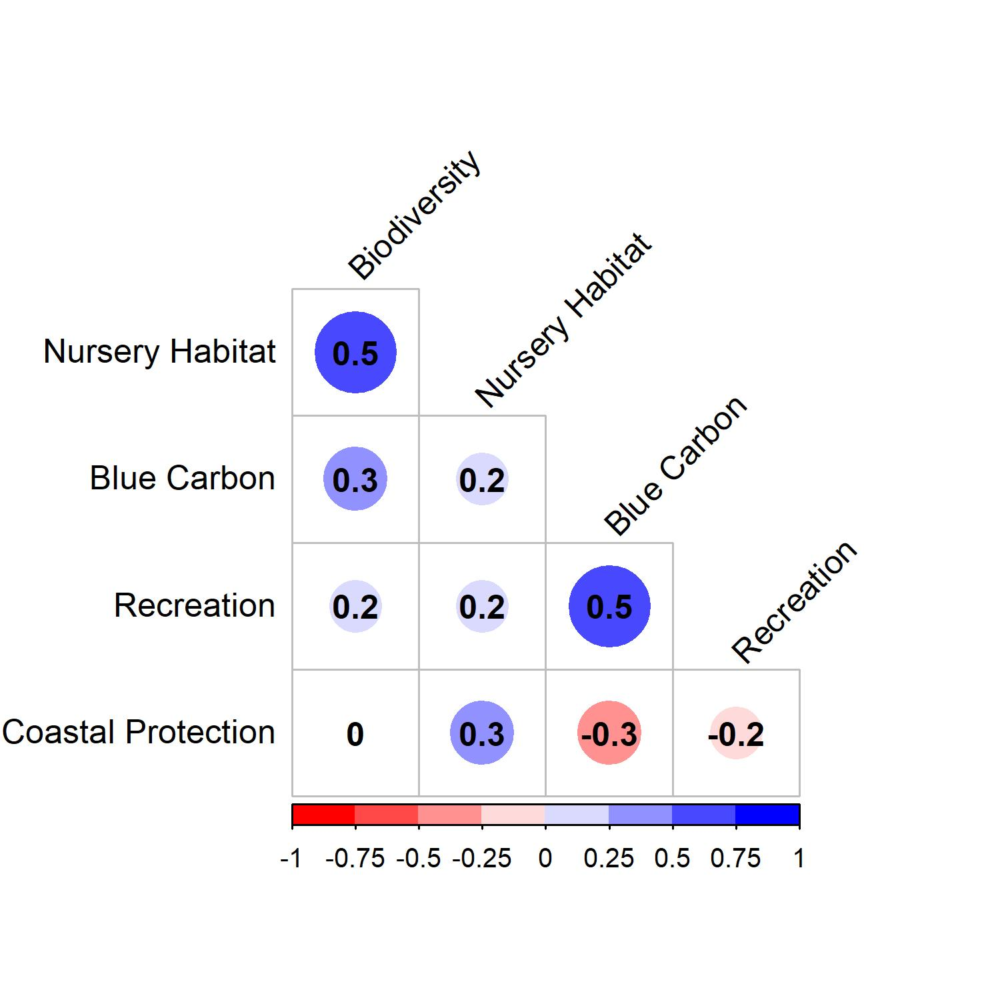
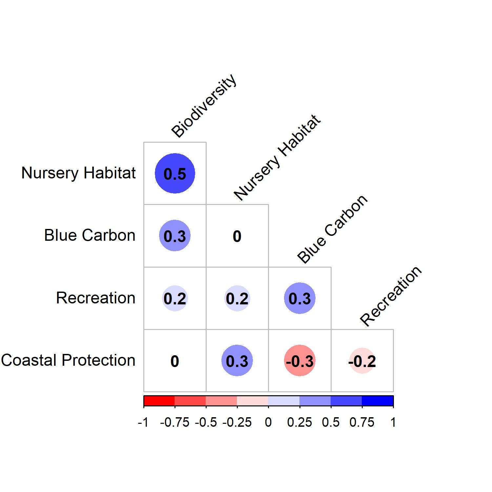
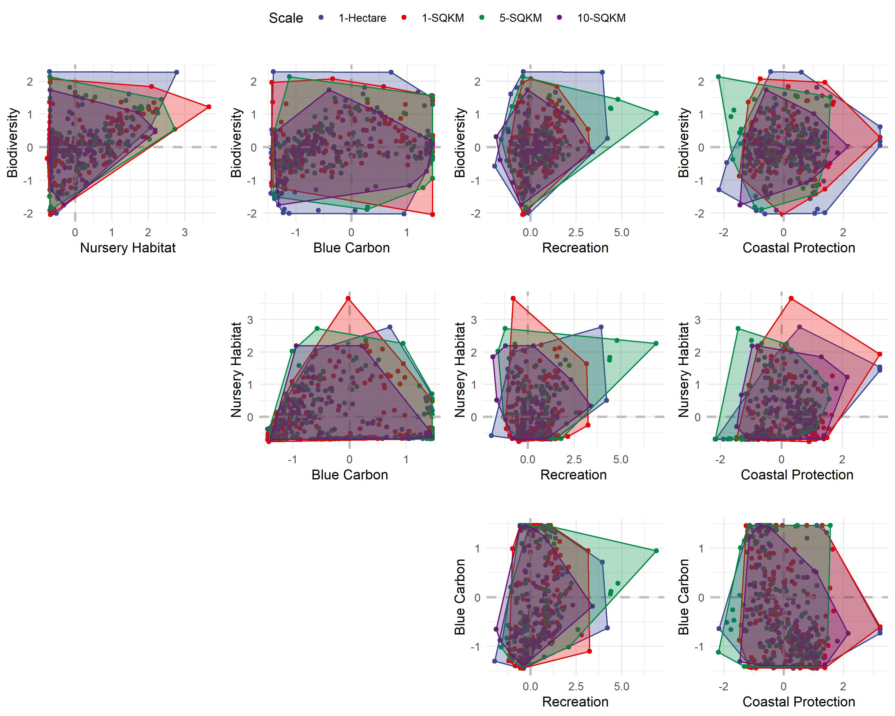

```{r setup, include=FALSE,fig.height=6}
knitr::opts_chunk$set(echo = FALSE, message = FALSE, warning = FALSE, fig.pos = "H", out.extra = "")

#Load Libraries
library(tidyverse)
library(raster)
library(RColorBrewer)
library(viridis)
library(ggpubr)
library(corrplot)
library(corrplot)
# remotes::install_version("Rttf2pt1", version = "1.3.8")
# library(extrafont)
library(colorspace)
library(paletteer); library(colorBlindness)
library("ggsci")
library("ggplot2")
library("gridExtra")
# library(rgeos)


#Setting Directory Paths
wd=getwd()

username=as.vector(strsplit(wd,"/"));names(username)<-c("username")

Saved_RData_Dir=paste("C:/Users/",username$username[3],"/Dropbox/GITHUB/Disseratation/",sep="")
```

# Paper Resources

Click [**here**](https://docs.google.com/document/d/1a-w1l9gmgQC8Fafp4zqLbFPMXytu6nq-nX5ImwAyuts/edit) to see the latest meeting notes in the Google Doc. 


To Do List:

* Make a matrix like the correlation plots but where it shows severity of trade-off instead (metric from Burgess paper)

* Make pairwise plots for all service combinations, for both conservation areas and for restoration areas   

* Make pairwise plots at two different scales (from practical standpoint, scale should match conservation/restoration scale)

* Look into ways to draw in frontier that minimizes impacts of outlines?

\newpage

# Visualizing Tradeoffs  plots of services 
```{r}

#Loading Data
# 1-Hectare Scale
ES_Zscores_PRAs_1HA_df <- read_csv("processed_datasets/ES_ZScores_PRAs_1HA.csv")

ES_Zscores_PRAs_1HA_df$Area<-c("Unconfirmed")
ES_Zscores_PRAs_1HA_df$Scale<-c("1-Hectare")

ES_Zscores_Confirmed_1HA_df <- read_csv("processed_datasets/ES_ZScores_Confirmed_1HA.csv")

ES_Zscores_Confirmed_1HA_df$Area<-c("Confirmed")
ES_Zscores_Confirmed_1HA_df$Scale<-c("1-Hectare")


names(ES_Zscores_PRAs_1HA_df)<-names(ES_Zscores_Confirmed_1HA_df)

ES_Zscores_1HA_df<-rbind(ES_Zscores_PRAs_1HA_df,ES_Zscores_Confirmed_1HA_df)


# 1-Kilometer Scale
ES_Zscores_PRAs_1KM_df <- read_csv("processed_datasets/ES_ZScores_PRAs_1KM.csv")

ES_Zscores_PRAs_1KM_df$Area<-c("Unconfirmed")
ES_Zscores_PRAs_1KM_df$Scale<-c("1-SQKM")

ES_Zscores_Confirmed_1KM_df <- read_csv("processed_datasets/ES_ZScores_Confirmed_1KM.csv")

ES_Zscores_Confirmed_1KM_df$Area<-c("Confirmed")
ES_Zscores_Confirmed_1KM_df$Scale<-c("1-SQKM")

names(ES_Zscores_PRAs_1KM_df)<-names(ES_Zscores_Confirmed_1KM_df)

ES_Zscores_1KM_df<-rbind(ES_Zscores_PRAs_1KM_df,ES_Zscores_Confirmed_1KM_df)

# 5-Kilometer Scale
ES_Zscores_PRAs_5KM_df <- read_csv("processed_datasets/ES_ZScores_PRAs_5KM.csv")

ES_Zscores_PRAs_5KM_df$Area<-c("Unconfirmed")
ES_Zscores_PRAs_5KM_df$Scale<-c("5-SQKM")

ES_Zscores_Confirmed_5KM_df <- read_csv("processed_datasets/ES_ZScores_Confirmed_5KM.csv")

ES_Zscores_Confirmed_5KM_df$Area<-c("Confirmed")
ES_Zscores_Confirmed_5KM_df$Scale<-c("5-SQKM")

names(ES_Zscores_PRAs_5KM_df)<-names(ES_Zscores_Confirmed_5KM_df)

ES_Zscores_5KM_df<-rbind(ES_Zscores_PRAs_5KM_df,ES_Zscores_Confirmed_5KM_df)

# 10 - Kilometer Scale
ES_Zscores_PRAs_10KM_df <- read_csv("processed_datasets/ES_ZScores_PRAs_10KM.csv")

ES_Zscores_PRAs_10KM_df$Area<-c("Unconfirmed")
ES_Zscores_PRAs_10KM_df$Scale<-c("10-SQKM")

ES_Zscores_Confirmed_10KM_df <- read_csv("processed_datasets/ES_ZScores_Confirmed_10KM.csv")

ES_Zscores_Confirmed_10KM_df$Area<-c("Confirmed")
ES_Zscores_Confirmed_10KM_df$Scale<-c("10-SQKM")

names(ES_Zscores_PRAs_10KM_df)<-names(ES_Zscores_Confirmed_10KM_df)

ES_Zscores_10KM_df<-rbind(ES_Zscores_PRAs_10KM_df,ES_Zscores_Confirmed_10KM_df)


```


## Simple corrplot for ES outcomes from potentail restoration areas for seagrasses

```{r,include=FALSE}
##Pearson Correlations 
ES_cors_1HA<-ES_Zscores_PRAs_1HA_df

names(ES_cors_1HA)<-c("ID","Longitude","Latitude","Biodiversity","Nursery Habitat","Blue Carbon","Recreation","Coastal Protection","Seagrass-Area","Scale")

#main ecosystem services
ES_cors_1HA<-round(cor(ES_cors_1HA[c(4:8)]),1)


#saving the output
jpeg("plots/Figure_1_1HA.jpg", units="in", width=5, height=5, res=300)

corrplot(ES_cors_1HA, type = 'lower', order = 'original', tl.col = 'black',
         cl.ratio = 0.2, tl.srt = 45, col= colorRampPalette(c("red","white","blue"))(8),addCoef.col = 'black',diag=FALSE)
dev.off()


##Pearson Correlations 
ES_cors_1KM<-ES_Zscores_PRAs_1KM_df

names(ES_cors_1KM)<-c("ID","Longitude","Latitude","Biodiversity","Nursery Habitat","Blue Carbon","Recreation","Coastal Protection","Seagrass-Area","Scale")

#main ecosystem services
ES_cors_1KM<-round(cor(ES_cors_1KM[c(4:8)]),1)

#saving the output
jpeg("plots/Figure_1_1KM.jpg", units="in", width=5, height=5, res=300)

corrplot(ES_cors_1KM, type = 'lower', order = 'original', tl.col = 'black',
         cl.ratio = 0.2, tl.srt = 45, col= colorRampPalette(c("red","white","blue"))(8),addCoef.col = 'black',diag=FALSE)
dev.off()
```

### Potential Restoration Areas (1-Hectare Res.)
The main difference between between PRAs and confirmed beds at this scale is that:

* Blue carbon is now positively correlated with biodiversity and recreation. 

* The negative correlation between recreation and coastal protection is also weaker.

```{r fig.cap= "Spatial associations among ecosystem service outcomes assocaited with potential restoration areas for seagrasses in the Florida Gulf Coast (1-Hectare Res)"}

```

\newpage

### Potential Restoration Areas (1-Square Kilometer Res.)
The main difference between PRAs at 1-hecatare vs 1-kilometer is that:

* The correlation between blue carbon and recreation is a bit weaker. 

```{r fig.cap= "Spatial associations among ecosystem service outcomes assocaited with potential restoration areas for seagrasses in the Florida Gulf Coast (1-SqKM Res)."}


```

\newpage

## Pairwise plots of services

```{r,include=FALSE}

ES_Zscores_1HA_df_X=sample_n(ES_Zscores_1HA_df, 1000)

ALPHA=0.5
### Biodiversity vs Nursery Habitat
p2_density <-ES_Zscores_1HA_df_X%>%
  ggplot(aes(y=BioDiv, x=NurHab,color=Area)) +
  # stat_density2d(geom="tile", aes(fill = ..density..), contour = FALSE) +
  geom_point(aes(colour = Area),alpha=ALPHA)+
  geom_smooth(method="lm")+facet_wrap(~Area)+
  ggtitle("") +
  ylab("Biodiversity") +
  xlab("Nursery Habitat")+
  geom_hline(yintercept = 0, colour="grey", linetype="dashed",size=1)+
  geom_vline(xintercept = 0, colour="grey", linetype="dashed",size=1)+
  scale_color_aaas()+ theme_minimal()+theme(legend.position="none") #+facet_wrap(~Area)


### Biodiversity vs Carbon Storage
p3_density <-ES_Zscores_1HA_df_X%>%
  ggplot(aes(y=BioDiv, x=BlueCar,color=Area)) +
  # stat_density2d(geom="tile", aes(fill = ..density..), contour = FALSE) +
  geom_point(aes(colour = Area),alpha=ALPHA)+
  geom_smooth(method="lm")+facet_wrap(~Area)+
  ggtitle("") +
  ylab("Biodiversity") + xlab("Blue Carbon")+  
  geom_hline(yintercept = 0, colour="grey", linetype="dashed",size=1)+
  geom_vline(xintercept = 0, colour="grey", linetype="dashed",size=1)+
  scale_color_aaas() + theme_minimal() +theme(legend.position="none") #+facet_wrap(~Area)


### Biodiversity vs Recreation
p4_density <-ES_Zscores_1HA_df_X%>%
  ggplot(aes(y=BioDiv, x=RecTour,color=Area)) +
  # stat_density2d(geom="tile", aes(fill = ..density..), contour = FALSE) +
  geom_point(aes(colour = Area),alpha=ALPHA)+
  geom_smooth(method="lm")+facet_wrap(~Area)+
  ggtitle("") +
  ylab("Biodiversity") + xlab("Recreation")+  
  geom_hline(yintercept = 0, colour="grey", linetype="dashed",size=1)+
  geom_vline(xintercept = 0, colour="grey", linetype="dashed",size=1)+
  scale_color_aaas() + theme_minimal()+theme(legend.position="none")  #+facet_wrap(~Area)


### Biodiversity vs Coastal Protection
p5_density <-ES_Zscores_1HA_df_X%>%
  ggplot(aes(y=BioDiv, x=Expos,color=Area)) +
  # stat_density2d(geom="tile", aes(fill = ..density..), contour = FALSE) +
  geom_point(aes(colour = Area),alpha=ALPHA)+
  geom_smooth(method="lm")+facet_wrap(~Area)+
  ggtitle("") +
  ylab("Biodiversity") + xlab("Coastal Protection")+  
  geom_hline(yintercept = 0, colour="grey", linetype="dashed",size=1)+
  geom_vline(xintercept = 0, colour="grey", linetype="dashed",size=1)+
  scale_color_aaas() + theme_minimal() +theme(legend.position="none") #+facet_wrap(~Area)


### Nursery Habitat vs Blue Carbon
p6_density <-ES_Zscores_1HA_df_X%>%
  ggplot(aes(y=NurHab, x=BlueCar,color=Area)) +
  # stat_density2d(geom="tile", aes(fill = ..density..), contour = FALSE) +
  geom_point(aes(colour = Area),alpha=ALPHA)+
  geom_smooth(method="lm")+facet_wrap(~Area)+
  ggtitle("") +
  ylab("Nursery Habitat") + xlab("Blue Carbon")+  
  geom_hline(yintercept = 0, colour="grey", linetype="dashed",size=1)+
  geom_vline(xintercept = 0, colour="grey", linetype="dashed",size=1)+
  scale_color_aaas() + theme_minimal()+theme(legend.position="none")  #+facet_wrap(~Area)


### Nursery Habitat vs Recreation
p7_density <-ES_Zscores_1HA_df_X%>%
  ggplot(aes(y=NurHab, x=RecTour,color=Area)) +
  # stat_density2d(geom="tile", aes(fill = ..density..), contour = FALSE) +
  geom_point(aes(colour = Area),alpha=ALPHA)+
  geom_smooth(method="lm")+facet_wrap(~Area)+
  ggtitle("") +
  ylab("Nursery Habitat") + xlab("Recreation")+  
  geom_hline(yintercept = 0, colour="grey", linetype="dashed",size=1)+
  geom_vline(xintercept = 0, colour="grey", linetype="dashed",size=1)+
  scale_color_aaas() + theme_minimal()+theme(legend.position="none")  #+facet_wrap(~Area)


### Nursery Habitat vs Coastal Protection
p8_density <-ES_Zscores_1HA_df_X%>%
  ggplot(aes(y=NurHab, x=Expos,color=Area)) +
  # stat_density2d(geom="tile", aes(fill = ..density..), contour = FALSE) +
  geom_point(aes(colour = Area),alpha=ALPHA)+
  geom_smooth(method="lm")+facet_wrap(~Area)+
  ggtitle("") +
  ylab("Nursery Habitat") + xlab("Coastal Protection")+  
  geom_hline(yintercept = 0, colour="grey", linetype="dashed",size=1)+
  geom_vline(xintercept = 0, colour="grey", linetype="dashed",size=1)+
  scale_color_aaas() + theme_minimal()+theme(legend.position="none")  #+facet_wrap(~Area)


### Blue Carbon vs Recreation
p9_density <-ES_Zscores_1HA_df_X%>%
  ggplot(aes(y=BlueCar, x=RecTour,color=Area)) +
  # stat_density2d(geom="tile", aes(fill = ..density..), contour = FALSE) +
  geom_point(aes(colour = Area),alpha=ALPHA)+
  geom_smooth(method="lm")+facet_wrap(~Area)+
  ggtitle("") +
  ylab("Blue Carbon") + xlab("Coastal Protection")+  
  geom_hline(yintercept = 0, colour="grey", linetype="dashed",size=1)+
  geom_vline(xintercept = 0, colour="grey", linetype="dashed",size=1)+
  scale_color_aaas() + theme_minimal() +theme(legend.position="none") #+facet_wrap(~Area) 


### Blue Carbon vs Coastal Protection
p10_density <-ES_Zscores_1HA_df_X%>%
  ggplot(aes(y=BlueCar, x=Expos,color=Area)) +
  # stat_density2d(geom="tile", aes(fill = ..density..), contour = FALSE) +
  geom_point(aes(colour = Area),alpha=ALPHA)+
  geom_smooth(method="lm")+facet_wrap(~Area)+
  ggtitle("") +
  ylab("Blue Carbon") + xlab("Coastal Protection")+  
  geom_hline(yintercept = 0, colour="grey", linetype="dashed",size=1)+
  geom_vline(xintercept = 0, colour="grey", linetype="dashed",size=1)+
  scale_color_aaas() + theme_minimal() + theme(legend.position="none") #facet_wrap(~Area)  


#blank
blank=ES_Zscores_1HA_df_X%>%
    ggplot(aes(y=NurHab, x=Expos))+xlab("")+ylab("")+theme(axis.line=element_blank(),axis.text.x=element_blank(),
          axis.text.y=element_blank(),axis.ticks=element_blank(),
          axis.title.x=element_blank(),
          axis.title.y=element_blank(),legend.position="none",
          panel.background=element_blank(),panel.border=element_blank(),panel.grid.major=element_blank(),
          panel.grid.minor=element_blank(),plot.background=element_blank())


#saving the output
jpeg("plots/Figure_2.jpg", units="in", width=12, height=8, res=300)
ggarrange(p2_density,p3_density,p4_density,
          p5_density, p6_density,p7_density,
          p8_density,p9_density, p10_density,nrow = 3, ncol=3,common.legend = TRUE)

# ggarrange(p2_density,p3_density,p4_density,p5_density,
#           blank, p6_density,p7_density,p8_density,
#           blank, blank, p9_density, p10_density,nrow = 3, ncol=4,common.legend = TRUE)
dev.off()

# ggarrange(blank,p6,p7,p8,nrow = 1, ncol=4,widths = c(2,2,2,2),heights = c(1,1,1,1))


```

### Restoration Areas vs Confirmed Beds (1-Hectare Scale)


```{r fig.cap= "Pairwise plots of ecosystem service outcomes assocaited with potential restoration areas (red) and confirmed beds (blue) for seagrasses in the Florida Gulf Coast (1-Hectare Res.).", out.width="90%"}
knitr::include_graphics('plots/Figure_2.jpg')

```

\newpage

### Scale Comparison for Restoration Areas (Scatterplots) - 1-ha vs 1-sqkm vs 5-sqkm vs 10-sqkm
```{r, include=FALSE}
ES_Zscores_1HA_df_X=sample_n(ES_Zscores_1HA_df, 250)
ES_Zscores_1KM_df_X=sample_n(ES_Zscores_1KM_df, 250)
ES_Zscores_5KM_df_X=sample_n(ES_Zscores_5KM_df, 250)
ES_Zscores_10KM_df_X=sample_n(ES_Zscores_10KM_df, 250)

ES_Zscores_Scale_Comparion_df_X=rbind(ES_Zscores_1HA_df_X,ES_Zscores_1KM_df_X,ES_Zscores_5KM_df_X,ES_Zscores_10KM_df_X)

ES_Zscores_Scale_Comparion_df_X=ES_Zscores_Scale_Comparion_df_X%>%
  filter(Area=="Unconfirmed")%>%
  mutate(Scale=factor(Scale,levels=c("1-Hectare","1-SQKM","5-SQKM","10-SQKM")))

ALPHA=0.5
### Biodiversity vs Nursery Habitat
p2_density <-ES_Zscores_Scale_Comparion_df_X%>%
  ggplot(aes(y=BioDiv, x=NurHab,color=Scale)) +
  geom_point(aes(colour = Scale),alpha=ALPHA)+
  geom_smooth(method="lm")+facet_wrap(~Scale,nrow = 1)+
  ggtitle("") +
  ylab("Biodiversity") +
  xlab("Nursery Habitat")+
  geom_hline(yintercept = 0, colour="grey", linetype="dashed",size=1)+
  geom_vline(xintercept = 0, colour="grey", linetype="dashed",size=1)+
  scale_color_aaas()+ theme_minimal()+theme(legend.position="none") #+facet_wrap(~Area)


### Biodiversity vs Carbon Storage
p3_density <-ES_Zscores_Scale_Comparion_df_X%>%
  ggplot(aes(y=BioDiv, x=BlueCar,color=Scale)) +
  geom_point(aes(colour = Scale),alpha=ALPHA)+
  geom_smooth(method="lm")+facet_wrap(~Scale,nrow = 1)+
  ggtitle("") +
  ylab("Biodiversity") + xlab("Blue Carbon")+  
  geom_hline(yintercept = 0, colour="grey", linetype="dashed",size=1)+
  geom_vline(xintercept = 0, colour="grey", linetype="dashed",size=1)+
  scale_color_aaas() + theme_minimal() +theme(legend.position="none") #+facet_wrap(~Area)


### Biodiversity vs Recreation
p4_density <-ES_Zscores_Scale_Comparion_df_X%>%
  ggplot(aes(y=BioDiv, x=RecTour,color=Scale)) +
  geom_point(aes(colour = Scale),alpha=ALPHA)+
  geom_smooth(method="lm")+facet_wrap(~Scale,nrow = 1)+
  ggtitle("") +
  ylab("Biodiversity") + xlab("Recreation")+  
  geom_hline(yintercept = 0, colour="grey", linetype="dashed",size=1)+
  geom_vline(xintercept = 0, colour="grey", linetype="dashed",size=1)+
  scale_color_aaas() + theme_minimal()+theme(legend.position="none")  #+facet_wrap(~Area)


### Biodiversity vs Coastal Protection
p5_density <-ES_Zscores_Scale_Comparion_df_X%>%
  ggplot(aes(y=BioDiv, x=Expos,color=Scale)) +
  # stat_density2d(geom="tile", aes(fill = ..density..), contour = FALSE) +
  geom_point(aes(colour = Scale),alpha=ALPHA)+
  geom_smooth(method="lm")+facet_wrap(~Scale,nrow = 1)+
  ggtitle("") +
  ylab("Biodiversity") + xlab("Coastal Protection")+  
  geom_hline(yintercept = 0, colour="grey", linetype="dashed",size=1)+
  geom_vline(xintercept = 0, colour="grey", linetype="dashed",size=1)+
  scale_color_aaas() + theme_minimal() +theme(legend.position="none") #+facet_wrap(~Area)


### Nursery Habitat vs Blue Carbon
p6_density <-ES_Zscores_Scale_Comparion_df_X%>%
  ggplot(aes(y=NurHab, x=BlueCar,color=Scale)) +
  # stat_density2d(geom="tile", aes(fill = ..density..), contour = FALSE) +
  geom_point(aes(colour = Scale),alpha=ALPHA)+
  geom_smooth(method="lm")+facet_wrap(~Scale,nrow = 1)+
  ggtitle("") +
  ylab("Nursery Habitat") + xlab("Blue Carbon")+  
  geom_hline(yintercept = 0, colour="grey", linetype="dashed",size=1)+
  geom_vline(xintercept = 0, colour="grey", linetype="dashed",size=1)+
  scale_color_aaas() + theme_minimal()+theme(legend.position="none")  #+facet_wrap(~Area)


### Nursery Habitat vs Recreation
p7_density <-ES_Zscores_Scale_Comparion_df_X%>%
  ggplot(aes(y=NurHab, x=RecTour,color=Scale)) +
  # stat_density2d(geom="tile", aes(fill = ..density..), contour = FALSE) +
  geom_point(aes(colour = Scale),alpha=ALPHA)+
  geom_smooth(method="lm")+facet_wrap(~Scale,nrow = 1)+
  ggtitle("") +
  ylab("Nursery Habitat") + xlab("Recreation")+  
  geom_hline(yintercept = 0, colour="grey", linetype="dashed",size=1)+
  geom_vline(xintercept = 0, colour="grey", linetype="dashed",size=1)+
  scale_color_aaas() + theme_minimal()+theme(legend.position="none")  #+facet_wrap(~Area)


### Nursery Habitat vs Coastal Protection
p8_density <-ES_Zscores_Scale_Comparion_df_X%>%
  ggplot(aes(y=NurHab, x=Expos,color=Scale)) +
  # stat_density2d(geom="tile", aes(fill = ..density..), contour = FALSE) +
  geom_point(aes(colour = Scale),alpha=ALPHA)+
  geom_smooth(method="lm")+facet_wrap(~Scale,nrow = 1)+
  ggtitle("") +
  ylab("Nursery Habitat") + xlab("Coastal Protection")+  
  geom_hline(yintercept = 0, colour="grey", linetype="dashed",size=1)+
  geom_vline(xintercept = 0, colour="grey", linetype="dashed",size=1)+
  scale_color_aaas() + theme_minimal()+theme(legend.position="none")  #+facet_wrap(~Area)


### Blue Carbon vs Recreation
p9_density <-ES_Zscores_Scale_Comparion_df_X%>%
  ggplot(aes(y=BlueCar, x=RecTour,color=Scale)) +
  # stat_density2d(geom="tile", aes(fill = ..density..), contour = FALSE) +
  geom_point(aes(colour = Scale),alpha=ALPHA)+
  geom_smooth(method="lm")+facet_wrap(~Scale,nrow = 1)+
  ggtitle("") +
  ylab("Blue Carbon") + xlab("Coastal Protection")+  
  geom_hline(yintercept = 0, colour="grey", linetype="dashed",size=1)+
  geom_vline(xintercept = 0, colour="grey", linetype="dashed",size=1)+
  scale_color_aaas() + theme_minimal() +theme(legend.position="none") #+facet_wrap(~Area) 


### Blue Carbon vs Coastal Protection
p10_density <-ES_Zscores_Scale_Comparion_df_X%>%
  ggplot(aes(y=BlueCar, x=Expos,color=Scale)) +
  # stat_density2d(geom="tile", aes(fill = ..density..), contour = FALSE) +
  geom_point(aes(colour = Scale),alpha=ALPHA)+
  geom_smooth(method="lm")+facet_wrap(~Scale,nrow = 1)+
  ggtitle("") +
  ylab("Blue Carbon") + xlab("Coastal Protection")+  
  geom_hline(yintercept = 0, colour="grey", linetype="dashed",size=1)+
  geom_vline(xintercept = 0, colour="grey", linetype="dashed",size=1)+
  scale_color_aaas() + theme_minimal() + theme(legend.position="none") #facet_wrap(~Area)  


#blank
blank=ES_Zscores_1KM_df_X%>%
    ggplot(aes(y=NurHab, x=Expos))+xlab("")+ylab("")+theme(axis.line=element_blank(),axis.text.x=element_blank(),
          axis.text.y=element_blank(),axis.ticks=element_blank(),
          axis.title.x=element_blank(),
          axis.title.y=element_blank(),legend.position="none",
          panel.background=element_blank(),panel.border=element_blank(),panel.grid.major=element_blank(),
          panel.grid.minor=element_blank(),plot.background=element_blank())


#saving the output
jpeg("plots/Figure_3a.jpg", units="in", width=6, height=6, res=300)
ggarrange(p2_density,p3_density,p4_density,

          nrow = 3, ncol=1,common.legend = TRUE)
dev.off()

jpeg("plots/Figure_3b.jpg", units="in", width=6, height=6, res=300)
ggarrange(p5_density, p6_density,p7_density,
          nrow = 3, ncol=1,common.legend = TRUE)
dev.off()

jpeg("plots/Figure_3c.jpg", units="in", width=6, height=6, res=300)
ggarrange(p8_density,p9_density, p10_density,
          nrow = 3, ncol=1,common.legend = TRUE)
dev.off()

```


Questions for the group about these plots:

* How can we make this a little more readable??
```{r fig.cap= "Scale comparison for restoration sites.", out.width="90%"}
knitr::include_graphics('plots/Figure_3a.jpg')
knitr::include_graphics('plots/Figure_3b.jpg')
knitr::include_graphics('plots/Figure_3c.jpg')

```


### Scale Comparison for Restoration Areas (Convex Hulls) - 1-ha vs 1-sqkm vs 5-sqkm vs 10-sqkm
```{r, include=FALSE}
ES_Zscores_1HA_df_X=sample_n(ES_Zscores_1HA_df, 250)
ES_Zscores_1KM_df_X=sample_n(ES_Zscores_1KM_df, 250)
ES_Zscores_5KM_df_X=sample_n(ES_Zscores_5KM_df, 250)
ES_Zscores_10KM_df_X=sample_n(ES_Zscores_10KM_df, 250)

ES_Zscores_Scale_Comparion_df_X=rbind(ES_Zscores_1HA_df_X,ES_Zscores_1KM_df_X,ES_Zscores_5KM_df_X,ES_Zscores_10KM_df_X)

ES_Zscores_Scale_Comparion_df_X=ES_Zscores_Scale_Comparion_df_X%>%
  filter(Area=="Unconfirmed")%>%
  mutate(Scale=factor(Scale,levels=c("1-Hectare","1-SQKM","5-SQKM","10-SQKM")))
  # mutate(Scale=factor(Scale,levels=c("1-Hectare","1-SQKM")))


### Biodiversity vs Nursery Habitat
p2 <-ES_Zscores_Scale_Comparion_df_X%>%
  ggplot(aes(y=BioDiv, x=NurHab,color=Scale)) +
  geom_point()+
  ggtitle("") +
  ylab("Biodiversity") +
  xlab("Nursery Habitat")+
  geom_hline(yintercept = 0, colour="grey", linetype="dashed",size=1)+
  geom_vline(xintercept = 0, colour="grey", linetype="dashed",size=1)+
  scale_color_aaas()+ theme_minimal()+theme(legend.position="none") #+facet_wrap(~Area)

hull_data <- ES_Zscores_Scale_Comparion_df_X%>%
  drop_na() %>%
  group_by(Scale) %>% 
  slice(chull(BioDiv, NurHab))
  
p2_hull<- p2 +geom_polygon(data = hull_data,
               aes(fill = Scale,
                   colour = Scale),
               alpha = 0.3,
               show.legend = FALSE) +  scale_color_aaas()+  scale_fill_aaas()
  
  
### Biodiversity vs Carbon Storage
p3 <-ES_Zscores_Scale_Comparion_df_X%>%
  ggplot(aes(y=BioDiv, x=BlueCar,color=Scale)) +
  geom_point()+
  ggtitle("") +
  ylab("Biodiversity") +
  xlab("Blue Carbon")+
  geom_hline(yintercept = 0, colour="grey", linetype="dashed",size=1)+
  geom_vline(xintercept = 0, colour="grey", linetype="dashed",size=1)+
  scale_color_aaas()+ theme_minimal()+theme(legend.position="none") #+facet_wrap(~Area)

hull_data <- ES_Zscores_Scale_Comparion_df_X%>%
  drop_na() %>%
  group_by(Scale) %>% 
  slice(chull(BioDiv, BlueCar))
  
p3_hull<-p3 +geom_polygon(data = hull_data,
               aes(fill = Scale,
                   colour = Scale),
               alpha = 0.3,
               show.legend = FALSE) +  scale_color_aaas()+  scale_fill_aaas()
  
### Biodiversity vs Recreation
p4 <-ES_Zscores_Scale_Comparion_df_X%>%
  ggplot(aes(y=BioDiv, x=RecTour,color=Scale)) +
  geom_point()+
  ggtitle("") +
  ylab("Biodiversity") +
  xlab("Recreation")+
  geom_hline(yintercept = 0, colour="grey", linetype="dashed",size=1)+
  geom_vline(xintercept = 0, colour="grey", linetype="dashed",size=1)+
  scale_color_aaas()+ theme_minimal()+theme(legend.position="none") #+facet_wrap(~Area)

hull_data <- ES_Zscores_Scale_Comparion_df_X%>%
  drop_na() %>%
  group_by(Scale) %>% 
  slice(chull(BioDiv, RecTour))
  
p4_hull<-p4 +geom_polygon(data = hull_data,
               aes(fill = Scale,
                   colour = Scale),
               alpha = 0.3,
               show.legend = FALSE) +  scale_color_aaas()+  scale_fill_aaas()

### Biodiversity vs Coastal Protection
p5 <-ES_Zscores_Scale_Comparion_df_X%>%
  ggplot(aes(y=BioDiv, x=Expos,color=Scale)) +
  geom_point()+
  ggtitle("") +
  ylab("Biodiversity") +
  xlab("Coastal Protection")+
  geom_hline(yintercept = 0, colour="grey", linetype="dashed",size=1)+
  geom_vline(xintercept = 0, colour="grey", linetype="dashed",size=1)+
  scale_color_aaas()+ theme_minimal()+theme(legend.position="none") #+facet_wrap(~Area)

hull_data <- ES_Zscores_Scale_Comparion_df_X%>%
  drop_na() %>%
  group_by(Scale) %>% 
  slice(chull(BioDiv, Expos))
  
p5_hull<-p5 +geom_polygon(data = hull_data,
               aes(fill = Scale,
                   colour = Scale),
               alpha = 0.3,
               show.legend = FALSE) +  scale_color_aaas()+  scale_fill_aaas()


### Nursery Habitat vs Blue Carbon
p6 <-ES_Zscores_Scale_Comparion_df_X%>%
  ggplot(aes(y=NurHab, x=BlueCar,color=Scale)) +
  geom_point()+
  ggtitle("") +
  ylab("Nursery Habitat") +
  xlab("Blue Carbon")+
  geom_hline(yintercept = 0, colour="grey", linetype="dashed",size=1)+
  geom_vline(xintercept = 0, colour="grey", linetype="dashed",size=1)+
  scale_color_aaas()+ theme_minimal()+theme(legend.position="none") #+facet_wrap(~Area)

hull_data <- ES_Zscores_Scale_Comparion_df_X%>%
  drop_na() %>%
  group_by(Scale) %>% 
  slice(chull(NurHab, BlueCar))
  
p6_hull<- p6 +geom_polygon(data = hull_data,
               aes(fill = Scale,
                   colour = Scale),
               alpha = 0.3,
               show.legend = FALSE) +  scale_color_aaas()+  scale_fill_aaas()


### Nursery Habitat vs Recreation
p7 <-ES_Zscores_Scale_Comparion_df_X%>%
  ggplot(aes(y=NurHab, x=RecTour,color=Scale)) +
  geom_point()+
  ggtitle("") +
  ylab("Nursery Habitat") +
  xlab("Recreation")+
  geom_hline(yintercept = 0, colour="grey", linetype="dashed",size=1)+
  geom_vline(xintercept = 0, colour="grey", linetype="dashed",size=1)+
  scale_color_aaas()+ theme_minimal()+theme(legend.position="none") #+facet_wrap(~Area)

hull_data <- ES_Zscores_Scale_Comparion_df_X%>%
  drop_na() %>%
  group_by(Scale) %>% 
  slice(chull(NurHab, RecTour))
  
p7_hull<- p7 +geom_polygon(data = hull_data,
               aes(fill = Scale,
                   colour = Scale),
               alpha = 0.3,
               show.legend = FALSE) +  scale_color_aaas()+  scale_fill_aaas()


### Nursery Habitat vs Coastal Protection
p8 <-ES_Zscores_Scale_Comparion_df_X%>%
  ggplot(aes(y=NurHab, x=Expos,color=Scale)) +
  geom_point()+
  ggtitle("") +
  ylab("Nursery Habitat") +
  xlab("Coastal Protection")+
  geom_hline(yintercept = 0, colour="grey", linetype="dashed",size=1)+
  geom_vline(xintercept = 0, colour="grey", linetype="dashed",size=1)+
  scale_color_aaas()+ theme_minimal()+theme(legend.position="none") #+facet_wrap(~Area)

hull_data <- ES_Zscores_Scale_Comparion_df_X%>%
  drop_na() %>%
  group_by(Scale) %>% 
  slice(chull(NurHab, Expos))
  
p8_hull<- p8 +geom_polygon(data = hull_data,
               aes(fill = Scale,
                   colour = Scale),
               alpha = 0.3,
               show.legend = FALSE) +  scale_color_aaas()+  scale_fill_aaas()


### Blue Carbon vs Recreation
p9 <-ES_Zscores_Scale_Comparion_df_X%>%
  ggplot(aes(y=BlueCar, x=RecTour,color=Scale)) +
  geom_point()+
  ggtitle("") +
  ylab("Blue Carbon") +
  xlab("Recreation")+
  geom_hline(yintercept = 0, colour="grey", linetype="dashed",size=1)+
  geom_vline(xintercept = 0, colour="grey", linetype="dashed",size=1)+
  scale_color_aaas()+ theme_minimal()+theme(legend.position="none") #+facet_wrap(~Area)

hull_data <- ES_Zscores_Scale_Comparion_df_X%>%
  drop_na() %>%
  group_by(Scale) %>% 
  slice(chull(BlueCar, RecTour))
  
p9_hull<- p9 +geom_polygon(data = hull_data,
               aes(fill = Scale,
                   colour = Scale),
               alpha = 0.3,
               show.legend = FALSE) +  scale_color_aaas()+  scale_fill_aaas()


### Blue Carbon vs Coastal Protection
p10 <-ES_Zscores_Scale_Comparion_df_X%>%
  ggplot(aes(y=BlueCar, x=Expos,color=Scale)) +
  geom_point()+
  ggtitle("") +
  ylab("Blue Carbon") +
  xlab("Coastal Protection")+
  geom_hline(yintercept = 0, colour="grey", linetype="dashed",size=1)+
  geom_vline(xintercept = 0, colour="grey", linetype="dashed",size=1)+
  scale_color_aaas()+ theme_minimal()+theme(legend.position="none") #+facet_wrap(~Area)

hull_data <- ES_Zscores_Scale_Comparion_df_X%>%
  drop_na() %>%
  group_by(Scale) %>% 
  slice(chull(BlueCar, Expos))
  
p10_hull<- p10 +geom_polygon(data = hull_data,
               aes(fill = Scale,
                   colour = Scale),
               alpha = 0.3,
               show.legend = FALSE) +  scale_color_aaas()+  scale_fill_aaas()


#blank
blank=ES_Zscores_Scale_Comparion_df_X%>%
    ggplot(aes(y=NurHab, x=Expos))+xlab("")+ylab("")+theme(axis.line=element_blank(),axis.text.x=element_blank(),
          axis.text.y=element_blank(),axis.ticks=element_blank(),
          axis.title.x=element_blank(),
          axis.title.y=element_blank(),legend.position="none",
          panel.background=element_blank(),panel.border=element_blank(),panel.grid.major=element_blank(),
          panel.grid.minor=element_blank(),plot.background=element_blank())


#saving the output
jpeg("plots/Figure_4.jpg", units="in", width=10, height=8, res=300)
ggarrange(p2_hull,p3_hull,p4_hull,p5_hull,
          blank, p6_hull,p7_hull,p8_hull,
          blank, blank, p9_hull, p10_hull,nrow = 3, ncol=4,common.legend = TRUE)
dev.off()

```

\newpage

Questions for the group about these plots:

* Does this seem easier to interpret or worse? lol  
```{r fig.cap= "Scale comparison for restoration sites.", out.width="90%"}


```


# Prioritization of restoration sites

Tutorial for PriortizR -> https://prioritizr.net/articles/gurobi_installation_guide.html

```{r fig.cap= ""}

```

# Potential Supplemental Figures
## Maps of ES outcomes associated with potential recovery areas (PRAs) for seagrasses
```{r , out.width="98%",fig.cap="Spatial variation in expected ecosystem service enhancement values of potentail restoration areas for seagrasses in the Florida Gulf Coast. Ecosystem service outcomes are quantified in terms of the standardized enhancement effect of seagrasses on the predicted biodiversity, nursery habitat, blue carbon storage, recreation, and coastal protection services relative to levels predicted if the location were unvegetated. Standardized ecosystem service values show how pixels all relative to mean ecosystem service supply for the region in units of standard deviation."}
knitr::include_graphics('plots/Figure_1a.jpg')
```

```{r,fig.cap="continued...",fig.width=4,fig.height=7}
knitr::include_graphics('plots/Figure_1b.jpg')
```

