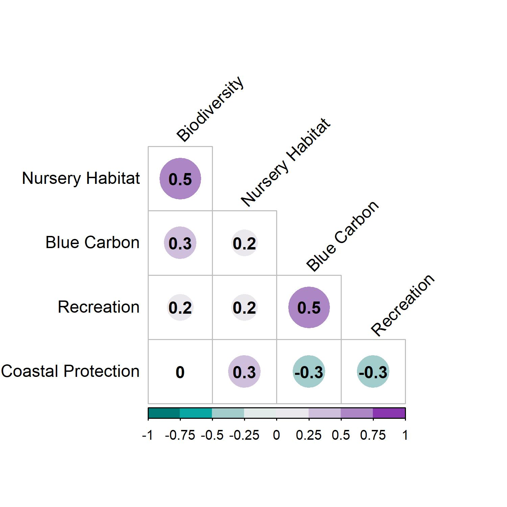
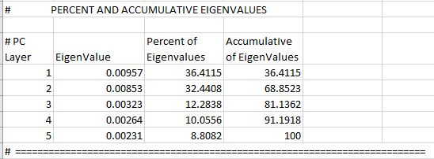
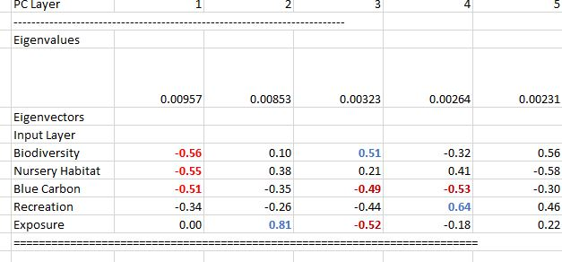
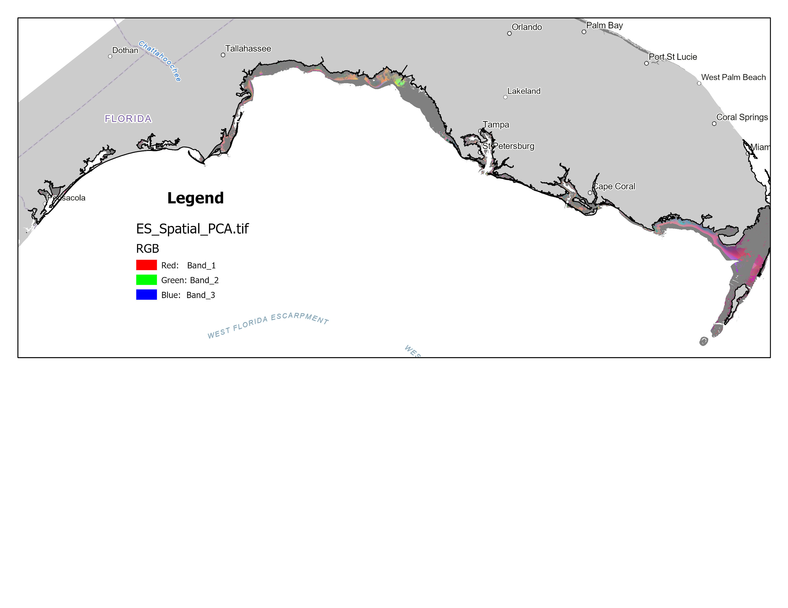

```{r setup, include=FALSE,fig.height=6}
knitr::opts_chunk$set(echo = FALSE, message = FALSE, warning = FALSE, fig.pos = "H", out.extra = "")

#Load Libraries
library(tidyverse)
library(raster)
library(RColorBrewer)
library(viridis)
library(ggpubr)
library(corrplot)
library(corrplot)
remotes::install_version("Rttf2pt1", version = "1.3.8")
library(extrafont)
library(colorspace)
library(paletteer); library(colorBlindness)

# library(rgeos)

#Load Functions 
pal_teal_blue_purple <- rainbow(12)


#Setting Directory Paths
wd=getwd()

username=as.vector(strsplit(wd,"/"));names(username)<-c("username")

Saved_RData_Dir=paste("C:/Users/",username$username[3],"/Dropbox/GITHUB/Disseratation/",sep="")
```

# Paper Resources:

Paper Meeting Notes in Google Docs (https://docs.google.com/document/d/1a-w1l9gmgQC8Fafp4zqLbFPMXytu6nq-nX5ImwAyuts/edit)

Latest "To Do List" 
* Make a matrix like the correlation plots but where it shows severity of trade-off instead (metric from Burgess paper)
* Make pairwise plots for all service combinations, for both conservation areas and for restoration areas   
* Make pairwise plots at two different scales (from practical standpoint, scale should match conservation/restoration scale)
* Look into ways to draw in frontier that minimizes impacts of outlines?

# Visualizing Tradeoffs  plots of services 
```{r}

#Loading Data
ES_Zscores_df <- read_csv("processed_datasets/ES_ZScores_PRAs.csv")
# load("processed_datasets/ES_ZScores_PRAs_Spatial_Layers.RData")

```


## Simple corrplot for ES outcomes from potentail restoration areas for seagrasses

Note that correlation plots for confirmed beds shows similar relationships except that now blue carbon is positively correlated with biodiversity and recreation. 
```{r fig.cap= "Spatial associations among ecosystem service outcomes assocaited with potential restoration areas for seagrasses in the Florida Gulf Coast."}
##Pearson Correlations 
ES_cors_df<-ES_Zscores_df

names(ES_cors_df)<-c("ID","Longitude","Latitude","Regions","Total Seagrass Cover","Biodiversity","Nursery Habitat","Gray Snapper","Lane Snapper","White Grunt","Spotted Seatrout","Sheepshead","Pink Shrimp","Blue Carbon","Recreation","Coastal Protection","Coastal Population")

#main ecosystem services
# ES_cors<-round(cor(ES_cors_df[c(5:6,13:16)]),1)
ES_cors<-round(cor(ES_cors_df[c(6:7,14:16)]),1)


#saving the output
jpeg("plots/Figure_1.jpg", units="in", width=5, height=5, res=300)

corrplot(ES_cors, type = 'lower', order = 'original', tl.col = 'black',
         cl.ratio = 0.2, tl.srt = 45, col = diverge_hcl(8,h=c(190,290),l=c(40,95)),addCoef.col = 'black',diag=FALSE)
dev.off()




```


## Expanded corrplot for ES outcomes from potential restoration areas for seagrasses
```{r,fig.cap="Spatial associations among ecosystem service outcomes assocaited with potential restoration areas for seagrasses in the Florida Gulf Coast. Note that this version includes assocations for individual nursery species."}

#expanded nursery habita tand other services
ES_cors_expanded<-round(cor(ES_cors_df[c(6,8:16)]),2)


#saving the output
jpeg("plots/Figure_2.jpg", units="in", width=7, height=7, res=300)
corrplot(ES_cors_expanded, type = 'lower', order = 'original', tl.col = 'black',
         cl.ratio = 0.2, tl.srt = 45, col = diverge_hcl(8,h=c(190,290),l=c(40,95)),addCoef.col = 'black',diag=FALSE)
dev.off()

knitr::include_graphics('plots/Figure_2.jpg')

```

## Pairwise plots of services 

### Biodiversity vs Nursery Habitat
```{r,out.height="90%"}

ES_Zscores_df_X=sample_n(ES_Zscores_df, 10000)

# Biodiversity and Nursery Habitat
# p2=ES_Zscores_df_X%>%
#   # mutate(BioDiv=round(BioDiv,1),NurHab=round(NurHab,1))%>%
#   ggplot(aes(y=BioDiv, x=NurHab, fill=stat(count)*93^2*0.0001))+ 
#   ylim(-3,8)+xlim(-3,8)+
#   labs(fill="Hectares")+
#   geom_hex(bins=12,color="black", limts=c(0,6000)) +
#   ggtitle("") + 
#   # theme_classic(base_size = 16, base_family = "Calibri")+
#   theme(legend.position="right") +ylab("Biodiversity Enhancment") +
#   xlab("Nursery Habitat")+
#   scale_fill_distiller(palette = "BuPu",direction = 1)+ 
#   geom_hline(yintercept = 0, colour="#FF6600", linetype="dashed",size=1)+
#   geom_vline(xintercept = 0, colour="#FF6600", linetype="dashed",size=1) 
# 
# p2


p2_density <-ES_Zscores_df_X%>%
  ggplot(aes(y=BioDiv, x=NurHab)) +
  stat_density2d(geom="tile", aes(fill = ..density..), contour = FALSE) + 
  geom_point(colour = "white")+ geom_smooth(method="glm",forumula = 'y ~ s(x, bs = "ts",k=4)')+
  ggtitle("") + 
  # theme_classic(base_size = 16, base_family = "Calibri")+
  ylab("Biodiversity Enhancment") +
  xlab("Nursery Habitat")+
  geom_hline(yintercept = 0, colour="#FF6600", linetype="dashed",size=1)+
  geom_vline(xintercept = 0, colour="#FF6600", linetype="dashed",size=1) 

p2_density
```

### Biodiversity vs Carbon Storage
```{r,out.height="90%"}
# 
# p3=ES_Zscores_df_X%>%
#   # mutate(BioDiv=round(BioDiv,1),BlueCar=round(BlueCar,1))%>%
#   ggplot(aes(y=BioDiv, x=BlueCar, fill=stat(count)*93^2*0.0001))+ 
#   ylim(-3,8)+xlim(-3,8)+
#   labs(fill="Hectares")+ 
#   geom_hex(bins=12,color="black", limts=c(0,6000)) + 
#   ggtitle("") + 
#   # theme_classic(base_size = 16, base_family = "Calibri")+
#   theme(legend.position="right") +ylab("Biodiversity Enhancment") + xlab("Blue Carbon Storage")+
#   scale_fill_distiller(palette = "BuPu",direction = 1)+ 
#   geom_hline(yintercept = 0, colour="#FF6600", linetype="dashed",size=1)+
#   geom_vline(xintercept = 0, colour="#FF6600", linetype="dashed",size=1)
# 
# p3


p3_density <-ES_Zscores_df_X%>%
  ggplot(aes(y=BioDiv, x=BlueCar)) +
  stat_density2d(geom="tile", aes(fill = ..density..), contour = FALSE) + 
  geom_point(colour = "white")+ geom_smooth(method="glm")+
  ggtitle("") + 
  # theme_classic(base_size = 16, base_family = "Calibri")+
  ylab("Biodiversity Enhancment") + xlab("Blue Carbon Storage")+
  geom_hline(yintercept = 0, colour="#FF6600", linetype="dashed",size=1)+
  geom_vline(xintercept = 0, colour="#FF6600", linetype="dashed",size=1) 

p3_density
```


### Carbon Storage vs Recreation
```{r,out.height="90%"}

# p9=ES_Zscores_df_X%>%
#   # mutate(RecTour=round(RecTour,1),BlueCar=round(BlueCar,1))%>%
#   ggplot(aes(y=BlueCar, x=RecTour,fill=stat(count)*93^2*0.0001))+  
#   ylim(-3,8)+xlim(-3,8)+
#   labs(fill="Hectares")+ 
#   geom_hex(bins=12,color="black", limts=c(0,6000)) +  
#   ggtitle("") +
#   # theme_classic(base_size = 16, base_family = "Calibri")+
#   theme(legend.position="right") +ylab("Blue Carbon Storage") + 
#   xlab("Recreational Use")+scale_fill_distiller(palette = "BuPu",direction = 1)+
#   geom_hline(yintercept = 0, colour="#FF6600", linetype="dashed",size=1)+
#   geom_vline(xintercept = 0, colour="#FF6600", linetype="dashed",size=1)
# p9

p4_density <-ES_Zscores_df_X%>%
  ggplot(aes(y=BlueCar, x=RecTour)) +
  stat_density2d(geom="tile", aes(fill = ..density..), contour = FALSE) + 
  geom_point(colour = "white")+ geom_smooth(method="glm")+
  ggtitle("") + 
  # theme_classic(base_size = 16, base_family = "Calibri")+
  xlab("Recreational Use") + ylab("Blue Carbon Storage")+
  geom_hline(yintercept = 0, colour="#FF6600", linetype="dashed",size=1)+
  geom_vline(xintercept = 0, colour="#FF6600", linetype="dashed",size=1) 

p4_density
```

### Nursery Habitat vs Coastal Protection
```{r,out.height="90%"}

# p8=ES_Zscores_df_X%>%
#   # mutate(NurHab=round(NurHab,1),Expos=round(Expos,1))%>%
#   ggplot(aes(y=NurHab, x=Expos, fill=stat(count)*93^2*0.0001))+ 
#     ylim(-3,8)+xlim(-3,8)+
#   labs(fill="Hectares")+ 
#   geom_hex(bins=12,color="black",limts=c(0,6000)) + ggtitle("") +
#   # theme_classic(base_size = 16, base_family = "Calibri")+
#   theme(legend.position="right") +xlab("Coastal Protection") + ylab("Nursery Habitat")+scale_fill_distiller(palette = "BuPu",direction = 1)+ geom_hline(yintercept = 0, colour="#FF6600", linetype="dashed",size=1)+geom_vline(xintercept = 0, colour="#FF6600", linetype="dashed",size=1)
# p8

p5_density <-ES_Zscores_df_X%>%
  ggplot(aes(y=NurHab, x=Expos)) +
  stat_density2d(geom="tile", aes(fill = ..density..), contour = FALSE) + 
  geom_point(colour = "white")+ geom_smooth(method="glm")+
  ggtitle("") + 
  # theme_classic(base_size = 16, base_family = "Calibri")+
  xlab("Coastal Protection") + ylab("Nursery Habitat")+
  geom_hline(yintercept = 0, colour="#FF6600", linetype="dashed",size=1)+
  geom_vline(xintercept = 0, colour="#FF6600", linetype="dashed",size=1) 

p5_density
```


### Recreation vs Coastal Protection 
```{r,out.height="90%"}
# p10=ES_Zscores_df_X%>%
#   # mutate(RecTour=round(RecTour,1),Expos=round(Expos,1))%>%
#   ggplot(aes(y=RecTour, x=Expos,fill=stat(count)*93^2*0.0001))+ 
#   ylim(-3,8)+xlim(-3,8)+
#   labs(fill="Hectares")+ 
#   geom_hex(bins=12,color="black", limts=c(0,6000)) +  
#   ggtitle("") +
#   # theme_classic(base_size = 16, base_family = "Calibri")+
#   theme(legend.position="right") +ylab("Recreation Use") + 
#   xlab("Coastal Protection")+ 
#   scale_fill_distiller(palette = "BuPu",direction = 1)+ 
#   geom_hline(yintercept = 0, colour="#FF6600", linetype="dashed",size=1)+
#   geom_vline(xintercept = 0, colour="#FF6600", linetype="dashed",size=1)
# p10

p6_density <-ES_Zscores_df_X%>%
  ggplot(aes(y=RecTour, x=Expos)) +
  stat_density2d(geom="tile", aes(fill = ..density..), contour = FALSE) + 
  geom_point(colour = "white")+ geom_smooth(method="glm")+
  ggtitle("") + 
  # theme_classic(base_size = 16, base_family = "Calibri")+
  xlab("Coastal Protection") + ylab("Recreation Use")+
  geom_hline(yintercept = 0, colour="#FF6600", linetype="dashed",size=1)+
  geom_vline(xintercept = 0, colour="#FF6600", linetype="dashed",size=1) 

p6_density
```


### Carbon Storage and Coastal Protection 
```{r,out.height="90%"}
# p11=ES_Zscores_df_X%>%
#   ggplot(aes(y=BlueCar, x=Expos,fill=stat(count)*93^2*0.0001))+ 
#   ylim(-3,8)+xlim(-3,8)+
#   labs(fill="Hectares")+ 
#   geom_hex(bins=12,color="black", limts=c(0,6000)) +  
#   ggtitle("") +
#   # theme_classic(base_size = 16, base_family = "Calibri")+
#   theme(legend.position="right") +ylab("Blue Carbon Storage") + 
#   xlab("Coastal Protection")+ 
#   scale_fill_distiller(palette = "BuPu",direction = 1)+ 
#   geom_hline(yintercept = 0, colour="#FF6600", linetype="dashed",size=1)+
#   geom_vline(xintercept = 0, colour="#FF6600", linetype="dashed",size=1)
# # Recreation and Coastal Protection 
# p11

p7_density <-ES_Zscores_df_X%>%
  ggplot(aes(y=BlueCar, x=Expos)) +
  stat_density2d(geom="tile", aes(fill = ..density..), contour = FALSE) + 
  geom_point(colour = "white")+ geom_smooth(method="glm")+
  ggtitle("") + 
  # theme_classic(base_size = 16, base_family = "Calibri")+
  xlab("Coastal Protection") + ylab("Blue Carbon Storage")+
  geom_hline(yintercept = 0, colour="#FF6600", linetype="dashed",size=1)+
  geom_vline(xintercept = 0, colour="#FF6600", linetype="dashed",size=1) 

p7_density
```

## Multi-dimensional plot of service bundles 
```{r fig.cap= ""}






```

# Prioritization of restoration sites
```{r fig.cap= ""}
https://prioritizr.net/articles/gurobi_installation_guide.html

```


# Potential Supplemental Figures 
## Maps of ES outcomes associated with potential recovery areas (PRAs) for seagrasses
```{r , out.width="98%",fig.cap="Spatial variation in expected ecosystem service enhancement values of potentail restoration areas for seagrasses in the Florida Gulf Coast. Ecosystem service outcomes are quantified in terms of the standardized enhancement effect of seagrasses on the predicted biodiversity, nursery habitat, blue carbon storage, recreation, and coastal protection services relative to levels predicted if the location were unvegetated. Standardized ecosystem service values show how pixels all relative to mean ecosystem service supply for the region in units of standard deviation."}
knitr::include_graphics('plots/Figure_1a.jpg')
```

```{r,fig.cap="continued...",fig.width=4,fig.height=7}
knitr::include_graphics('plots/Figure_1b.jpg')
```

